MVR Version DIN SPEC 15801 Draft 1

# Introduction

GDTF, as specified in DIN SPEC 15800, solved the issue of unifying the description of (lighting) devices. Now several software products make use of the same GDTF file. 
To enable all applications to exchange environmental information as well as planning data based on GDTF files, the new DIN SPEC shall unify the information exchange of all this data and will be called MVR – My Virtual Rig.

In the entertainment industry, the MVR file format allows programs to
share data and geometry for a scene. A scene is a set of parametric
objects such as fixtures, trusses, video screens, and other objects that
are used in the entertainment industry.

Typical workflow
1.  Program A saves an MVR file containing a scene;
2.  Program B imports this file;
3.  Program B changes some parametric data in the scene;
4.  Program B saves an MVR containing the scene;
5.  Program A imports this file and applies the changes to the existing objects.


# Scope

This document specifies "My Virtual Rig" (MVR), which is designed to provide a unified way of listing and describing the hierarchical and logical structure based on DIN SPEC 15800 "General Device Type Format" (GDTF) - and further environmental information of a show setup in the lighting and entertainment business. It will be used as a foundation for the exchange of extended device and environmental data between lighting consoles, CAD and 3D-pre-visualization applications. The purpose of an MVR-file is to reflect the real-world physical components of a show setup and the logical patch information of the devices while maintaining the kinematic chain.


# Normative references

The following documents are referred to in the text in such a way that
some or all of their content constitutes requirements of this document.
For dated references, only the edition cited applies. For undated
references, the latest edition of the referenced document (including any
amendments) applies. 

- [ISO/IEC 21320-1:2015 Document Container File - Part 1: Core](https://www.iso.org/standard/60101.html)
- [PKWARE 6.3.3](https://pkware.cachefly.net/webdocs/casestudies/APPNOTE.TXT)
- [Wikipedia ZIP (file format)](https://en.wikipedia.org/wiki/ZIP_(file_format))
- [DIN SPEC 15800 (General Device Type Format (GDTF))](https://www.beuth.de/en/technical-rule/din-spec-15800/349717520)
- [UTF-8 - RFC3629](https://datatracker.ietf.org/doc/html/rfc3629)
- [UUID - RFC4122](https://www.rfc-editor.org/rfc/rfc4122)
- [DNS - RFC1035](https://www.ietf.org/rfc/rfc1035.txt)
- [DNS-SD - RFC6763](https://www.ietf.org/rfc/rfc6763.txt)
- [mDNS - RFC6762](https://www.ietf.org/rfc/rfc6762.txt)
- [Websocket Protocol - RFC6455](https://www.ietf.org/rfc/rfc6455.txt)

# Terms and definitions

For the purposes of this document, the following terms and definitions
apply. DIN and DKE maintain terminological databases for use in
standardization at the following addresses:

  - DIN-TERMinologieportal: available at
    <https://www.din.de/go/din-term>
  - DKE-IEV: available at <http://www.dke.de/DKE-IEV>


### My Virtual Rig MVR

descriptive name of the specification


# MVR Definitions

## General

MVR exists of two parts to enable any applications to exchange GDTF but also general information in the same common format. Therefore, a MVR file format is defined.
To simplify the exchange of MVR File formats a MVR communication format will be defined.


# File Format Definition

To describe all information within one file, a zip file with the extension `*.mvr` is used. The archive shall containe one Root file named `GeneralSceneDescription.xml`, along with all other resource files referenced via this Root File. The root file `GeneralSceneDescription.xml` is mandatory inside the archive to be a valid MVR file.

- The archive must not use encryption or password protection.
- All files referenced by the Root File shall be placed at the root level. They shall not be placed in folders.
- Files shall be placed using either STORE (uncompressed) or DEFLATE compression. No other compression algorithms are supported.
- Files may be placed into the archive in any order.
- A `Universal.gdtt` GDTF template file with a `.gdtt` extension can be added as to define Gobos, Emitters, Filter and such for referencing.
- Filenames within the archive must not differ only by case. Eg it is prohibited to have the files `GEO1.glb` and `geo1.glb` within the same archive.
- The file name of the ZIP archive can be chosen freely.

All objects used have a persistent unique ID to track changes between the exchanging programs.
If there are no changes to the original GDTF file it is mandatory to keep it in the MVR during export.
If there are changes to the GDTF file it is mandatory to add a revision to the GDTF file in order to reflect it.

Only user-intended modifications of any part of the MVR file shall be processed. This is particular important if applications in the workflow do not need or accept all data of the MVR file. This way it is guranteed that all later steps in the workflow have access to the original intented data.


Example of a typical MVR archive:

```
GeneralSceneDescription.xml
Custom@Fixture1.gdtf
Custom@Fixture2.gdtf
geo1.3ds
geo1.glb
Textr12.png
Universal.gdtt
```

# Node Definiftions

## General

UTF-8 has to be used to encode the XML file. Each XML file internally
consists of XML nodes. Each XML node could have XML attributes and XML
children. Each XML attribute has a value. If a XML attribute is not
specified, the default value of this XML attribute will be used. If the
XML attribute value is specified as a string, the format of the string
will depend on the XML attribute type. 

## Generic Value Types

Here is a list of the available types for node or attribute values:

##### Table 43 — *XML Generic Value Types*

| Value Type Name                               | Description                                                                                                                                                                                                                                                                                                                                                                                                                                                       |
| --------------------------------------------- | ----------------------------------------------------------------------------------------------------------------------------------------------------------------------------------------------------------------------------------------------------------------------------------------------------------------------------------------------------------------------------------------------------------------------------------------------------------------- |
| <span id="attrType-integer"> Integer </span>  | A signed or unsigned integer value represented in base 10. Uses a dash '-' (U+002D) as a prefix to denote negative numbers<br/>Eg `15` or `-6`                                                                                                                                                                                                                                                                                                                    |
| <span id="attrType-Float"> Float </span>      | A floating point numeric value represented in base 10 decimal or scientific format.<br/>Uses full stop '.' (U+002E) to delimit the whole and decimal part and 'e' or 'E' to delimit mantissa and exponent.<br/>Implementations shall write sufficient decimal places to precisely round-trip their internal level of precision.<br/>Infinities and not-a-number (NaN) are not permitted.<br/>Eg `1.5`, `3.9265e+2`                                                |
| <span id="attrType-String"> String </span>    | Any sequence of Unicode codepoints, encoded as necessary for XML.<br>Eg The following XML encodings (with their meaning in brackets):<br/>`&lt;` (\<), `&amp;` (&), `&gt;` (\>), `&quot;` ("), and `&apos;` (')                                                                                                                                                                                                                                                   |
| <span id="attrType-UUID"> UUID </span>        | A UUID to RFC4122 in text representation.<br/>The nil UUID (all zeros) is not permitted.<br/>Formatted as `XXXXXXXX-XXXX-XXXX-XXXX-XXXXXXXXXXXX`                                                                                                                                                                                                                                                                                                                  |
| <span id="attrType-Vector">Vector</span>      | Three Float values separated by ',' defining a 3D vector's X, Y, and Z components.<br/>Eg `1.0,2.0,3.0`                                                                                                                                                                                                                                                                                                                                                           |
| <span id="attrType-FileName">FileName</span>  | The case-sensitive name of a file within the archive including the extension.<br/>The filename must not contain any FAT32 or NTFS reserved characters.<br/>The extension is delimited from the base name by full stop '.' and the base name shall not be empty.<br/>It is recommended to limit filenames to the POSIX "Fully Portable Filenames" character set: [A-Z], [a-z], [0-9], the symbols '\_' (U+005F), '-' (U+002D) and a maximum of one '.' (U+002E)<br/>Eg `My-Fixture_5.gdtf` |
| <span id="attrType-CIEColor">CIE Color</span> | CIE 1931 xyY absolute color point.<br/>Formatted as three Floats `x,y,Y`<br/>Eg `0.314303,0.328065,87.699166`                                                                                                                                                                                                                                            |


## Root File Definition

The first XML node is always the XML description node: `<?xml version="1.0" encoding="UTF-8"?>`

The second XML node is the mandatory GeneralSceneDescription node. The attributes of this node are listed in Table 1. 

##### Table 1 — *Root File Node Attributes*

| Attribute Name | Attribute Value Type                      | Default Value when Optional | Description                                  |
| -------------- | ----------------------------------------- | --------------------------- | ------------------------------------------------------------------- |
| VerMajor       | [Integer](#user-content-attrtype-integer) | Not Optional                | Denotes the major version of the format used when saving this file. |
| VerMinor       | [Integer](#user-content-attrtype-integer) | Not Optional                | Denotes the minor version of the format used when saving this file. |

##### Table 2 — *Root File Node Children*

| Child Node | Allowed Count | Description                                    |
| ---------- | ------------- | ---------------------------------------------- |
| UserData   | 0 or 1        | Specifies user data associated with this file. |
| Scene      | 1             | Defines the scene described in this file.      |

Find a complete example of a file [here
](Sample_GeneralSceneDescription).


## Node Definition: UserData

This node contains a collection of user data nodes defined and used by
provider applications if required. User data should not be expected to be preserved in the workflow of mulitple applications importing/exporting the data.

Node name: `UserData`

##### Table 3 — *UserData Node Attributes*

| Child Node                    | Allowed Count | Description                   |
| ----------------------------- | ------------- | ----------------------------- |
| [Data](#node-definition-data) | 0 or many     | Defines a block of user data. |


### Node Definition: Data

This node contains a collection of data specified by the provider
application.

Node name: `Data`

##### Table 4 — *Data Node Attributes*

| Attribute Name | Attribute Value Type                    | Default Value when Optional | Description                                                               |
| -------------- | --------------------------------------- | --------------------------- | ------------------------------------------------------------------------- |
| Provider       | [String](#user-content-attrtype-string) | Not Optional                | Specifies the name of the provider application that created this data.    |
| Ver            | [String](#user-content-attrtype-string) | 1                           | Version information of the data as specified by the provider application. |


## Node Definition: Scene

This node contains information about the scene.

Node name: `Scene`

##### Table 5 — *Scene Node Children*

| Child Node                          | Allowed Count | Description                           |
| ----------------------------------- | ------------- | ------------------------------------- |
| [AUXData](#node-definition-auxdata) | 0 or 1        | Defines auxiliary data for the scene. |
| [Layers](#node-definition-layers)   | 1             | A list of layers in the scene.        |


## Node Definition: AUXData

This node contains auxiliary data for the scene node.

Node name: `AUXData`

##### Table 5 — *AUXData Node Attributes*

| Child Node                                              | Allowed Count | Description                                                    |
| ------------------------------------------------------- | ------------- | ---------------------------------------------------------------|
| [Symdef](#node-definition-symdef)                       | 0 or any      | Graphical representation that will be instanced in the scene.  |
| [Position](#node-definition-position)                   | 0 or any      | Defines a logical group of lighting devices.                   |
| [MappingDefinition](#node-definition-mappingdefinition) | 0 or any      | Defines a input source for fixture color mapping applications. |
| [Class](#node-definition-class)                         | 0 or any      | Defines a Class for object visiblity filtering.                |


### Node Definition: Symdef

This node contains the graphics so the scene can refer to this, thus
optimizing repetition of the geometry. The child objects are located
within a local coordinate system.

Node name: `Symdef`

##### Table 6 — *Symdef Node Attributes*

| Attribute Name | Attribute Value Type                    | Default Value when Optional | Description                          |
| -------------- | --------------------------------------- | --------------------------- | ------------------------------------ |
| UUID           | [UUID](user-content-attrtype-uuid)      | Not Optional                | The unique identifier of the object. |
| Name           | [String](#user-content-attrtype-string) | Empty                       | The name of the object               |

The child list contains a list of the following nodes:

| Child Node                                | Description                                                          |
| ----------------------------------------- | -------------------------------------------------------------------- |
| [Geometry3D](#node-definition-geometry3d) | The geometry of this definition that will be instanced in the scene. |
| [Symbol](#node-definition-symbol)         | The symbol instance that will provide a geometry of this definition. |


### Node Definition: Position

This node defines a logical grouping of lighting devices and trusses.

Node name: `Position`

##### Table 7 — *Position Node Attributes*

| Attribute Name | Attribute Value Type                    | Default Value when Optional | Description                          |
| -------------- | --------------------------------------- | --------------------------- | ------------------------------------ |
| UUID           | [UUID](#user-content-attrtype-uuid)     | Not Optional                | The unique identifier of the object. |
| Name           | [String](#user-content-attrtype-string) | Empty                       | The name of the object               |


### Node Definition: MappingDefinition

This node specified a input source for fixture color mapping
applications.

Node name: `MappingDefinition`

##### Table 8 — *MappingDefinition Node Attributes*

| Attribute Name | Attribute Value Type                | Default Value when Optional | Description                             |
| -------------- | ----------------------------------- | --------------------------- | --------------------------------------- |
| UUID           | [UUID](#user-content-attrtype-uuid) | Not Optional                | The unique identifier of the object.    |
| Name           | [String](#user-content-attrtype-string)              |                             | The name of the source for the mapping. |

| Child Node                                        | Allowed Count | Description                                         |
| ------------------------------------------------- | ------------- | --------------------------------------------------- |
| [SizeX](#node-definition-sizex)                   | 1             | The size in x direction in pixels of the source.    |
| [SizeY](#node-definition-sizey)                   | 1             | The size in x direction in pixels of the source.    |
| [Source](#node-definition-source)                 | 1             | The video source that will be used for the Mapping. |
| [ScaleHandeling](#node-definition-scalehandeling) | 0 or 1        | How the source will be scaled to the mapping.       |

```xml
<MappingDefinition name="MappingStyle for View 1" uuid="BEF95EB8-98AC-4217-B10D-FB4B83381398">
    <SizeX>1920</SizeX>
    <SizeY>1080</SizeY>
   movie.mov
    
    <ScaleHandeling>UpScale</ScaleHandeling>
</MappingDefinition>
```


### Node Definition: Class

This node defines a logical grouping across different layers. Primarily used for controlling object visibility of objects across multiple Layers.

Node name: `Class`

##### Table 9 — *Class Node Attributes*

| Attribute Name | Attribute Value Type                | Default Value when Optional | Description                         |
| -------------- | ----------------------------------- | --------------------------- | ----------------------------------- |
| UUID           | [UUID](#user-content-attrtype-uuid) | Not Optional                | The unique identifier of the class. |
| Name           | [String](#user-content-attrtype-string)              |                             | The name of the Class.              |


## Node Definition: Layers

This node defines a list of layers inside the scene. The layer is a
container of graphical objects defining a local coordinate system.

Node name: `Layers`

The child list contains a list of layer nodes:

##### Table 10 — *Layers Node Childs*

| Child Node                      | Description             |
| ------------------------------- | ----------------------- |
| [Layer](#node-definition-layer) | A layer representation. |


### Node Definition: Layer

This node defines a layer. The layer is a spatial representation of a
geometric container. The child objects are located inside a local
coordinate system.

Node name: `Layer`

##### Table 11 — *Layer Node Attributes*

| Attribute Name | Attribute Value Type                    | Default Value when Optional | Description                          |
| -------------- | --------------------------------------- | --------------------------- | ------------------------------------ |
| UUID           | [UUID](#user-content-attrtype-uuid)     | Not Optional                | The unique identifier of the object. |
| Name           | [String](#user-content-attrtype-string) | Empty                       | The name of the object               |

| Child Node                              | Allowed Count | Description                                                                                                                                                                                                                                                                      |
| --------------------------------------- | ------------- | -------------------------------------------------------------------------------------------------------------------------------------------------------------------------------------------------------------------------------------------------------------------------------- |
| [Matrix](#node-definition-matrix)       | 0 or 1        | The transformation matrix that defines the location and orientation of this the layer inside its global coordinate space. This effectively defines local coordinate space for the objects inside. The Matrix of the Layer is only allowed to have a vertical Transform (elevation). Rotation and scale must be identity. Rotation and scale must be identity, means no rotation and no scale. |
| [ChildList](#node-definition-childlist) | 1             | A list of graphic objects that are part of the layer.                                                                                                                                                                                                                            |
## Node Definition: ChildList

This node defines a list of graphical objects.

Node name: `ChildList`

The child list contains a list of one of the following nodes:

##### Table 42 — *ChildList Node Childlist*

| Child Node                                  | Description                                                                  |
| ------------------------------------------- | ---------------------------------------------------------------------------- |
| [SceneObject](#node-definition-sceneobject) | A generic graphical object from the scene.                                   |
| [GroupObject](#node-definition-groupobject) | A grouping object of other graphical objects inside local coordinate system. |
| [FocusPoint](#node-definition-focuspoint)   | A definition of a focus point.                                               |
| [Fixture](#node-definition-fixture)         | A definition of a fixture.                                                   |
| [Support](#node-definition-support)         | A definition of a support.                                                   |
| [Truss](#node-definition-truss)             | A definition of a truss.                                                     |
| [VideoScreen](#node-definition-videoscreen) | A definition of a video screen.                                              |
| [Projector](#node-definition-projector) | A definition of a projector.                                              |


## Node Definition for Parametric Objects

### Node Definition: SceneObject

This node defines a generic graphical object.

Node name: `SceneObject`

##### Table 12 — *SceneObject Node Attributes*

| Attribute Name | Attribute Value Type                  | Default Value when Optional | Description                          |
| -------------- | ------------------------------------- | --------------------------- | ------------------------------------ |
| UUID           | [UUID](#user-content-attrtype-uuid)   | Not Optional                | The unique identifier of the object. |
| Name           | [String](#user-content-attrtype-name) | Empty                       | The name of the object               |

| Child Node                                        | Allowed Count | Value Type                                  | Description                                                                                                                                   |
| ------------------------------------------------- | ------------- | ------------------------------------------- | --------------------------------------------------------------------------------------------------------------------------------------------- |
| [Matrix](#node-definition-matrix)                 | 0 or 1        |                                             | The location and orientation of the object inside the parent coordinate system.                                                               |
| [Classing](#node-definition-classing)             | 0 or 1        | [UUID](#user-content-attrtype-uuid)         | The Class the object belongs to.                                                                                                              |
| [Geometries](#node-definition-geometries)         | 1             |                                             | A list of geometrical representation objects that are part of the object.                                                                     |
| GDTFSpec                                          | 0 or 1        | [FileName](#user-content-attrtype-filename) | The name of the file containing the GDTF information for this object, conforming to the DIN SPEC 15800.                                       |
| GDTFMode                                          | 1             | [String](#user-content-attrtype-string)     | The name of the used DMX mode. This has to match the name of a DMXMode in the GDTF file.                                                      |
| [Addresses](#node-definition-addresses)           | 0 or 1        |                                             | The container for DMX Addresses for this object.                                                                                              |
| [Alignments](#node-definition-alignments)         | 0 or 1        |                                             | The container for Alignments for this object.                                                                                                 |
| [CustomCommands](#node-definition-customcommands) | 0 or 1        |                                             | The container for custom command for this object.                                                                                             |
| [Overwrites](#node-definition-overwrites)         | 0 or 1        |                                             | The container for overwrites for this object.                                                                                                 |
| [Connections](#node-definition-connections)       | 0 or 1        |                                             | The container for connections for this object.                                                                                                |
| FixtureID                                         | 0 or 1        | [String](#user-content-attrtype-string)     | The Fixture ID of the object. This is the short name of the object.                                                                           |
| UnitNumber                                        | 0 or 1        | [Integer](#user-content-attrtype-integer)   | The unit number of the object in a position.                                                                                                  |
| FixtureTypeId                                     | 0 or 1        | [Integer](#user-content-attrtype-integer)   | The Fixture Type ID is a value that can be used as a short name of the Fixture Type. This does not have to be unique. The default value is 0. |
| CustomId                                          | 0 or 1        | [Integer](#user-content-attrtype-integer)   | The Custom ID is a value that can be used as a short name of the Fixture Instance. This does not have to be unique. The default value is 0.   |
| [ChildList](#node-definition-childlist) | 1             | A list of graphic objects that are part of the layer.                                                                                                                                                                                                                            |


### Node Definition: GroupObject

This node defines logical group of objects. The child objects are
located inside a local coordinate system.

Node name: `GroupObject`

##### Table 13 — *GroupObject Node Attributes*

| Attribute Name | Attribute Value Type                    | Default Value when Optional | Description                          |
| -------------- | --------------------------------------- | --------------------------- | ------------------------------------ |
| UUID           | [UUID](#user-content-attrtype-uuid)     | Not Optional                | The unique identifier of the object. |
| Name           | [String](#user-content-attrtype-string) | Empty                       | The name of the object               |

| Child Node                              | Allowed Count | Value Type                          | Description                                                                     |
| --------------------------------------- | ------------- | ----------------------------------- | ------------------------------------------------------------------------------- |
| [Matrix](#node-definition-matrix)       | 0 or 1        |                                     | The location and orientation of the object inside the parent coordinate system. |
| [Classing](#node-definition-classing)   | 0 or 1        | [UUID](#user-content-attrtype-uuid) | The Class the object belongs to.                                                |
| [ChildList](#node-definition-childlist) | 1             |                                     | A list of graphic objects that are part of the group.                           |


### Node Definition: FocusPoint

This node defines a focus point object.

Node name: `FocusPoint`

##### Table 14 — *FocusPoint Node Attributes*

| Attribute Name | Attribute Value Type                    | Default Value when Optional | Description                          |
| -------------- | --------------------------------------- | --------------------------- | ------------------------------------ |
| UUID           | [UUID](#user-content-attrtype-uuid)     | Not Optional                | The unique identifier of the object. |
| Name           | [String](#user-content-attrtype-string) | Empty                       | The name of the object               |

| Child Node                                | Allowed Count | Value Type                          | Description                                                                     |
| ----------------------------------------- | ------------- | ----------------------------------- | ------------------------------------------------------------------------------- |
| [Matrix](#node-definition-matrix)         | 0 or 1        |                                     | The location and orientation of the object inside the parent coordinate system. |
| [Classing](#node-definition-classing)     | 0 or 1        | [UUID](#user-content-attrtype-uuid) | The Class the object belongs to.                                                |
| [Geometries](#node-definition-geometries) | 1             |                                     | A list of geometrical representation objects that are part of the object.       |


### Node Definition: Fixture

This node defines a light fixture object.

Node name: `Fixture`

##### Table 15 — *Fixture Node Attributes*

| Attribute Name | Attribute Value Type                    | Default Value when Optional | Description                          |
| -------------- | --------------------------------------- | --------------------------- | ------------------------------------ |
| UUID           | [UUID](#user-content-attrtype-uuid)     | Not Optional                | The unique identifier of the object. |
| Name           | [String](#user-content-attrtype-string) | Empty                       | The Name is the value that represents the fixture object. Is is not unique, and normally pairs with  FID in Display               |

| Child Node                              | Allowed Count | Value Type                                   | Description                                                                                                                                   |
| --------------------------------------- | ------------- | -------------------------------------------- | --------------------------------------------------------------------------------------------------------------------------------------------- |
| [Matrix](#node-definition-matrix)       | 0 or 1        |                                              | The location of the object inside the parent coordinate system. |
| [Classing](#node-definition-classing)   | 0 or 1        | [UUID](#user-content-attrtype-uuid)          | The Class the object belongs to.                                |
| GDTFSpec                                | 0 or 1        | [FileName](#user-content-attrtype-filename)  | The name of the file containing the GDTF information for this object, conforming to the DIN SPEC 15800. |
| GDTFMode                                | 1             | [String](#user-content-attrtype-string)      | The name of the used DMX mode. This has to match the name of a DMXMode in the GDTF file.                                                      |
| Focus                                   | 0 or 1        | [UUID](#user-content-attrtype-uuid)          | A focus point reference that this lighting fixture aims at if this reference exists.                                                          |
| CastShadow                              | 0 or 1        | [Bool](#attrType-Bool)                       | Defines if a Object cast Shadows.                                                                                                             |
| Position                                | 0 or 1        | [UUID](#user-content-attrtype-uuid)          | A position reference that this lighting fixture belongs to if this reference exists.                                                          |
| Function                                | 0 or 1        | [String](#user-content-attrtype-string)      | The name of the purpose this Fixture is used for.                                                       |
| FixtureID                               | 1             | [String](#user-content-attrtype-string)      | The Fixture ID is an identifier for the intance this fixture that you be used to activate / select them for programming.                                                            |
| FixtureIDNumeric                        | 1             | [Integer](#user-content-attrtype-integer)      | The Fixture ID is an identifier for the intance this fixture that you be used to activate / select them for programming.                                                            |
| UnitNumber                              | 1             | [Integer](#user-content-attrtype-integer)    | The identification of a fixture on its position.                                                                                        |
| ChildPosition                           | 0 or 1        | [String](#user-content-attrtype-node)        | Node Link to the Geometry. Starting point is the Geometry Collect of the linked parent GDTF of this object.                                   |
| [Addresses](#node-definition-addresses) | 0 or 1        |                                              | The container for DMX Addresses for this fixture.                                                                                             |
| [Alignments](#node-definition-alignments) | 0 or 1        |                                              | The container for Alignments for this fixture.                                                                                             |
| [CustomCommands](#node-definition-customcommands) | 0 or 1        |                                              | The container for custom command for this fixture.                                                                                             |
| [Overwrites](#node-definition-overwrites) | 0 or 1        |                                              | The container for overwrites for this fixture.                                                                                             |
| [Connections](#node-definition-connections) | 0 or 1        |                                             | The container for connections for this fixture.                                                                                             |
| CIEColor                                | 0 or 1        | [CIE Color](#user-content-attrtype-ciecolor) | A color assigned to a fixture. If it is not defined, there is no color for the fixture.                                                       |
| FixtureTypeId                           | 0 or 1        | [Integer](#user-content-attrtype-integer)    | The Fixture Type ID is a value that can be used as a short name of the Fixture Type. This does not have to be unique. The default value is 0. |
| CustomId                                | 0 or 1        | [Integer](#user-content-attrtype-integer)    | The Fixture ID is an identifier for the instance this fixture within the Custom ID Type that you be used to activate / select them for programming.   |
| Mappings                                | 0 or 1        | [Mappings](#node-definition-mappings)        | The container for Mappings for this fixture.                                                                                                  |
| [Gobo](#node-definition-gobo)                                    | 0 or 1        | [Gobo](#node-definition-gobo)                | The Gobo used for the fixture. The image resource must apply to the GDTF standard.                                                           |
| [ChildList](#node-definition-childlist) | 1             | A list of graphic objects that are part of the layer.                                                                                                                                                                                                                            |

Note: _The fixture has no `Geometries` node as geometry is defined in a
GDTF file._

CustomID Types
- 1 Fixture
- 2 Channel
- 4 Houselights
- 5 NonDim
- 6 Media
- 7 Fog
- 8 Effect
- 9 Pyro
- 10 Marker


An example of a node definition is shown below:

```xml
<Fixture name="Robe Robin MMX WashBeam" uuid="8BF13DD7-CBF4-415B-99E4-625FE4D2DAF6">
    <Matrix>{0.158127,-0.987419,0.000000}{0.987419,0.158127,0.000000}{0.000000,0.000000,1.000000}{6020.939200,2838.588955,4978.134459}</Matrix>
    <GDTFSpec>Custom@Robe Robin MMX WashBeam</GDTFSpec>
    <GDTFMode>DMX Mode</GDTFMode>
    <Focus>4A B1 94 62 A6 E3 4C 3B B2 5A D8 09 9F 78 17 0C</Focus>
    <Position>77 BC DE 16 95 A6 47 25 9D 04 16 A0 BD 67 CD 1A</Position>
    <Addresses>
        <Address break="0">45</Address>
    </Addresses>
    <Alignments>
        <Alignment geometry="Beam" up="0,0,1" direction="0,0,-1"/>
    </Alignments>
     <CustomCommands>
        <CustomCommand>Body_Pan,f 50</CustomCommand>
        <CustomCommand>Yoke_Tilt,f 50</CustomCommand>
    </CustomCommands>
    <Overwrites>
            <Overwrite universal="Universal Wheel 1.Universal Wheel Slot 1" target="Wheel 1.Wheel Slot"/>
            <Overwrite universal="Universal Emitter 1" target="Emitter 1" />
            <Overwrite universal="Universal Filter 1" target="Filter 1" />
            <Overwrite universal="Universal Wheel 1.Universal Wheel Slot 2"/>
    </Overwrites>
    <Mappings>
        <Mapping linkedDef="BEF95EB8-98AC-4217-B10D-FB4B83381398">
            <ux>10</ux>
            <uy>10</uy>
            <ox>5</ox>
            <oy>5</oy>
            <rz>45</rz>
        </Mapping>
    </Mappings>
    <Connections>    
      <Connection own="Input" toObject="8BF13DD7-CBF4-415B-99E4-625FE4D2DAF6" other="Output1"/>
      <Connection own="1" toObject="8BF13DD7-CBF4-415B-99E4-625FE4D2DAF6" other="IN"/>
      <Connection own="2" toObject="8BF13DD7-CBF4-415B-99E4-625FE4D2DAF6" other="IN"/>
    </Connections>
    <FixtureID></FixtureID>
    <UnitNumber>0</UnitNumber>
    <Function>Speaker 1</Function>
    <FixtureTypeId>0</FixtureTypeId>
    <CustomId>0</CustomId>
    <Color>2.533316,-5.175210,3.699302</Color>
    <Gobo rotation="32.5">image_file_forgobo</Gobo>
    <ChildList>
      <Fixture name="Fancy Attachment to the Beam" uuid="8BF13DD7-CBF4-415B-99E4-625FE4D2DAF5">
        <GDTFSpec>Fancy@Attachment</GDTFSpec>
        <GDTFMode>DMX Mode</GDTFMode>
        <!-->The parent GDTF here is the one from the Robe Robin MMX WashBeam</!-->
        <ChildPosition>Base.Yoke.Head</ChildPosition>
        <!-->The position is now defined based on the ECS from the geometry of parents GDTF including all applied Rotation via DMX or other protocols</!-->
        <Matrix>{0.158127,-0.987419,0.000000}{0.987419,0.158127,0.000000}{0.000000,0.000000,1.000000}{6020.939200,2838.588955,4978.134459}</Matrix>
      </Fixture>
    </ChildList>
</Fixture>
```


## Node Definition: Truss

This node defines a truss object.

Node name: `Truss`

##### Table 28 — *Truss Node Attributes*

| Attribute Name | Attribute Value Type                    | Default Value when Optional | Description                          |
| -------------- | --------------------------------------- | --------------------------- | ------------------------------------ |
| UUID           | [UUID](#user-content-attrtype-uuid)     | Not Optional                | The unique identifier of the object. |
| Name           | [String](#user-content-attrtype-string) | Empty                       | The name of the object               |


| Child Node                                        | Allowed Count | Value Type                                  | Description                                                                                                                                   |
| ------------------------------------------------- | ------------- | ------------------------------------------- | --------------------------------------------------------------------------------------------------------------------------------------------- |
| [Matrix](#node-definition-matrix)                 | 0 or 1        |                                             | The location of the object inside the parent coordinate system.                                                                               |
| [Classing](#node-definition-classing)             | 0 or 1        | [UUID](#user-content-attrtype-uuid)         | The Class the object belongs to.                                                                                                              |
| [Position](#node-definition-position)             | 0 or 1        | [UUID](#user-content-attrtype-uuid)         | A position reference that this truss belongs to if this reference exists.                                                                     |
| [Geometries](#node-definition-geometries)         | 1             |                                             | A list of geometrical representation objects that are a part of the object.                                                                   |
| Function                                          | 0 or 1        | [String](#user-content-attrtype-string)     | The name of the function this Truss is used for.                                                                                              |
| GDTFSpec                                          | 0 or 1        | [FileName](#user-content-attrtype-filename) | The name of the file containing the GDTF information for this object, conforming to the DIN SPEC 15800.                                       |
| GDTFMode                                          | 1             | [String](#user-content-attrtype-string)     | The name of the used DMX mode. This has to match the name of a DMXMode in the GDTF file.                                                      |
| [Addresses](#node-definition-addresses)           | 0 or 1        |                                             | The container for DMX Addresses for this object.                                                                                              |
| [Alignments](#node-definition-alignments)         | 0 or 1        |                                             | The container for Alignments for this object.                                                                                                 |
| [CustomCommands](#node-definition-customcommands) | 0 or 1        |                                             | The container for custom command for this object.                                                                                             |
| [Overwrites](#node-definition-overwrites)         | 0 or 1        |                                             | The container for overwrites for this object.                                                                                                 |
| [Connections](#node-definition-connections)       | 0 or 1        |                                             | The container for connections for this object.                                                                                                |
| ChildPosition                           | 0 or 1        | [String](#user-content-attrtype-node)        | Node Link to the Geometry. Starting point is the Geometry Collect of the linked parent GDTF of this object.                                   |
| [ChildList](#node-definition-childlist) | 1             | A list of graphic objects that are part of the layer.                                                                                                                                                                                                                            |
| FixtureID                                         | 0 or 1        | [String](#user-content-attrtype-string)     | The Fixture ID of the object. This is the short name of the object.                                                                           |
| UnitNumber                                        | 0 or 1        | [Integer](#user-content-attrtype-integer)   | The unit number of the object in a position.                                                                                                  |
| FixtureTypeId                                     | 0 or 1        | [Integer](#user-content-attrtype-integer)   | The Fixture Type ID is a value that can be used as a short name of the Fixture Type. This does not have to be unique. The default value is 0. |
| CustomId                                          | 0 or 1        | [Integer](#user-content-attrtype-integer)   | The Custom ID is a value that can be used as a short name of the Fixture Instance. This does not have to be unique. The default value is 0.   |


## Node Definition: Support

This node defines a support object.

Node name: `Support`

##### Table 29 — *Support Node Attributes*

| Attribute Name | Attribute Value Type                    | Default Value when Optional | Description                          |
| -------------- | --------------------------------------- | --------------------------- | ------------------------------------ |
| UUID           | [UUID](#user-content-attrtype-uuid)     | Not Optional                | The unique identifier of the object. |
| Name           | [String](#user-content-attrtype-string) | Empty                       | The name of the object               |

| Child Node                                        | Allowed Count | Value Type                                   | Description                                                                                                                                   |
| ------------------------------------------------- | ------------- | -------------------------------------------- | --------------------------------------------------------------------------------------------------------------------------------------------- |
| [Matrix](#node-definition-matrix)                 | 0 or 1        |                                              | The location of the object inside the parent coordinate system.                                                                               |
| [Classing](#node-definition-classing)             | 0 or 1        | [UUID](#user-content-attrtype-uuid)          | The Class the object belongs to.                                                                                                              |
| [Position](#node-definition-position)             | 0 or 1        | [UUID](#user-content-attrtype-uuid)          | A position reference that this support belongs to if this reference exists.                                                                   |
| [Geometries](#node-definition-geometries)         | 1             |                                              | A list of geometrical representation objects that are a part of the object.                                                                   |
| Function                                          | 0 or 1        | [String](#user-content-attrtype-string)      | The name of the function this support is used for.                                                                                            |
| ChainLength                                       | 1             | [Real](#user-content-attrtype-real)          | The chain length that will be applied to the GDTF .                                                                                           |
| GDTFSpec                                          | 0 or 1        | [FileName](#user-content-attrtype-filename)  | The name of the file containing the GDTF information for this object, conforming to the DIN SPEC 15800.                                       |
| GDTFMode                                          | 1             | [String](#user-content-attrtype-string)      | The name of the used DMX mode. This has to match the name of a DMXMode in the GDTF file.                                                      |
| [Addresses](#node-definition-addresses)           | 0 or 1        |                                              | The container for DMX Addresses for this object.                                                                                              |
| [Alignments](#node-definition-alignments)         | 0 or 1        |                                              | The container for Alignments for this object.                                                                                                 |
| [CustomCommands](#node-definition-customcommands) | 0 or 1        |                                              | The container for custom command for this object.                                                                                             |
| [Overwrites](#node-definition-overwrites)         | 0 or 1        |                                              | The container for overwrites for this object.                                                                                                 |
| [Connections](#node-definition-connections)       | 0 or 1        |                                              | The container for connections for this object.                                                                                                |
| FixtureID                                         | 0 or 1        | [String](#user-content-attrtype-string)      | The Fixture ID of the object. This is the short name of the object.                                                                           |
| UnitNumber                                        | 0 or 1        | [Integer](#user-content-attrtype-integer)    | The unit number of the object in a position.                                                                                                  |
| FixtureTypeId                                     | 0 or 1        | [Integer](#user-content-attrtype-integer)    | The Fixture Type ID is a value that can be used as a short name of the Fixture Type. This does not have to be unique. The default value is 0. |
| CustomId                                          | 0 or 1        | [Integer](#user-content-attrtype-integer)    | The Custom ID is a value that can be used as a short name of the Fixture Instance. This does not have to be unique. The default value is 0.   |
| [ChildList](#node-definition-childlist) | 1             | A list of graphic objects that are part of the layer.                                                                                                                                                                                                                            |


## Node Definition: VideoScreen

This node defines a video screen object.

Node name: `VideoScreen`

##### Table 30 — *VideoScreen Node Attributes*

| Attribute Name | Attribute Value Type                    | Default Value when Optional | Description                          |
| -------------- | --------------------------------------- | --------------------------- | ------------------------------------ |
| UUID           | [UUID](#user-content-attrtype-uuid)     | <Not Optional>              | The unique identifier of the object. |
| Name           | [String](#user-content-attrtype-string) | Empty                       | The name of the object.              |

| Child Node                                        | Allowed Count | Value Type                                   | Description                                                                                                                                   |
| ------------------------------------------------- | ------------- | -------------------------------------------- | --------------------------------------------------------------------------------------------------------------------------------------------- |
| [Matrix](#node-definition-matrix)                 | 0 or 1        |                                              | The location of the object inside the parent coordinate system.                                                                               |
| [Classing](#node-definition-classing)             | 0 or 1        | [UUID](#user-content-attrtype-uuid)          | The Class the object belongs to.                                                                                                              |
| [Geometries](#node-definition-geometries)         | 1             |                                              | A list of geometrical representation objects that are a part of the object.                                                                   |
| [Sources](#node-definition-sources)               | 0 or 1        |                                              | A list of video input sources..                                                                                                               |
| Function                                          | 0 or 1        | [String](#user-content-attrtype-string)      | The name of the function this VideoScreen is used for.                                                                                        |
| GDTFSpec                                          | 0 or 1        | [FileName](#user-content-attrtype-filename)  | The name of the file containing the GDTF information for this object, conforming to the DIN SPEC 15800.                                       |
| GDTFMode                                          | 1             | [String](#user-content-attrtype-string)      | The name of the used DMX mode. This has to match the name of a DMXMode in the GDTF file.                                                      |
| [Addresses](#node-definition-addresses)           | 0 or 1        |                                              | The container for DMX Addresses for this object.                                                                                              |
| [Alignments](#node-definition-alignments)         | 0 or 1        |                                              | The container for Alignments for this object.                                                                                                 |
| [CustomCommands](#node-definition-customcommands) | 0 or 1        |                                              | The container for custom command for this object.                                                                                             |
| [Overwrites](#node-definition-overwrites)         | 0 or 1        |                                              | The container for overwrites for this object.                                                                                                 |
| [Connections](#node-definition-connections)       | 0 or 1        |                                              | The container for connections for this object.                                                                                                |
| [ChildList](#node-definition-childlist) | 1             | A list of graphic objects that are part of the layer.                                                                                                                                                                                                                            |
| FixtureID                                         | 0 or 1        | [String](#user-content-attrtype-string)      | The Fixture ID of the object. This is the short name of the object.                                                                           |
| UnitNumber                                        | 0 or 1        | [Integer](#user-content-attrtype-integer)    | The unit number of the object in a position.                                                                                                  |
| FixtureTypeId                                     | 0 or 1        | [Integer](#user-content-attrtype-integer)    | The Fixture Type ID is a value that can be used as a short name of the Fixture Type. This does not have to be unique. The default value is 0. |
| CustomId                                          | 0 or 1        | [Integer](#user-content-attrtype-integer)    | The Custom ID is a value that can be used as a short name of the Fixture Instance. This does not have to be unique. The default value is 0.   |


An example of a node definition is shown below:

```xml
<VideoScreen name="Television" uuid="BEF95EB8-98AC-4217-B10D-FB4B83381398">
    <Matrix>{0.158127,-0.987419,0.000000}{0.987419,0.158127,0.000000}{0.000000,0.000000,1.000000}{6020.939200,2838.588955,4978.134459}</Matrix>
    <GDTFSpec>Generic@TV</GDTFSpec>
    <GDTFMode>DisplayModeWideScreen</GDTFMode>
    <Addresses>
        <Address break="0">45</Address>
    </Addresses>
    <FixtureID>25</FixtureID>
    <UnitNumber>0</UnitNumber>
    <FixtureTypeId>0</FixtureTypeId>
    <CustomId>0</CustomId>
    <Sources>
    movie.mov
   </Sources>
</Fixture>
```


## Node Definition: Projector

This node defines a video projector object.

Node name: `Projector`

##### Table 31 — *Projector Node Attributes*

| Attribute Name | Attribute Value Type                    | Default Value when Optional | Description                          |
| -------------- | --------------------------------------- | --------------------------- | ------------------------------------ |
| UUID           | [UUID](#user-content-attrtype-uuid)     |  Not Optional               | The unique identifier of the object. |
| Name           | [String](#user-content-attrtype-string) | Empty                       | The name of the object.              |

| Child Node                                        | Allowed Count | Value Type                                  | Description                                                                                                                                   |
| ------------------------------------------------- | ------------- | ------------------------------------------- | --------------------------------------------------------------------------------------------------------------------------------------------- |
| [Matrix](#node-definition-matrix)                 | 0 or 1        |                                             | The location of the object inside the parent coordinate system.                                                                               |
| [Classing](#node-definition-classing)             | 0 or 1        | [UUID](#user-content-attrtype-uuid)         | The Class the object belongs to.                                                                                                              |
| [Geometries](#node-definition-geometries)         | 1             |                                             | A list of geometrical representation objects that are a part of the object.                                                                   |
| [Projections](#node-definition-projection)        | 1             |                                             | A list of video source for Beam Geometries in the GDTF file.                                                                                  |
| GDTFSpec                                          | 0 or 1        | [FileName](#user-content-attrtype-filename) | The name of the file containing the GDTF information for this object, conforming to the DIN SPEC 15800.                                       |
| GDTFMode                                          | 1             | [String](#user-content-attrtype-string)     | The name of the used DMX mode. This has to match the name of a DMXMode in the GDTF file.                                                      |
| [Addresses](#node-definition-addresses)           | 0 or 1        |                                             | The container for DMX Addresses for this object.                                                                                              |
| [Alignments](#node-definition-alignments)         | 0 or 1        |                                             | The container for Alignments for this object.                                                                                                 |
| [CustomCommands](#node-definition-customcommands) | 0 or 1        |                                             | The container for custom command for this object.                                                                                             |
| [Overwrites](#node-definition-overwrites)         | 0 or 1        |                                             | The container for overwrites for this object.                                                                                                 |
| [Connections](#node-definition-connections)       | 0 or 1        |                                             | The container for connections for this object.                                                                                                |
| [ChildList](#node-definition-childlist) | 1             | A list of graphic objects that are part of the layer.                                                                                                                                                                                                                            |
| FixtureID                                         | 0 or 1        | [String](#user-content-attrtype-string)     | The Fixture ID of the object. This is the short name of the object.                                                                           |
| UnitNumber                                        | 0 or 1        | [Integer](#user-content-attrtype-integer)   | The unit number of the object in a position.                                                                                                  |
| FixtureTypeId                                     | 0 or 1        | [Integer](#user-content-attrtype-integer)   | The Fixture Type ID is a value that can be used as a short name of the Fixture Type. This does not have to be unique. The default value is 0. |
| CustomId                                          | 0 or 1        | [Integer](#user-content-attrtype-integer)   | The Custom ID is a value that can be used as a short name of the Fixture Instance. This does not have to be unique. The default value is 0.   |


An example of a node definition is shown below:

```xml
<Projector name="Projector" uuid="BEF95EB8-98AC-4217-B10D-FB4B83381398">
    <Matrix>{0.158127,-0.987419,0.000000}{0.987419,0.158127,0.000000}{0.000000,0.000000,1.000000}{6020.939200,2838.588955,4978.134459}</Matrix>
    <GDTFSpec>Generic@Projector</GDTFSpec>
    <GDTFMode>Projector@ThrowRatio1_7_to_2_2</GDTFMode>
    <Addresses>
        <Address break="0">45</Address>
    </Addresses>
    <FixtureID>25</FixtureID>
    <UnitNumber>0</UnitNumber>
    <FixtureTypeId>0</FixtureTypeId>
    <CustomId>0</CustomId>
    <Projections>
        <Projection>movie.mov
            
            <ScaleHandeling>UpScale</ScaleHandeling>
        </Projection>
    </Projections>
</Projector> 
```


## Other Node Definition


### Node Definition: Matrix

This node contains a definition of a transformation matrix.

- Right-handed
- Z-Up
- 1 Distance Unit equals 1 mm

Node name: `Matrix`

##### Table 41 — *Matrix Node Value Types*

| Value Type                                                | Default Value When Missing   | Description                                                                                                                                   |
| --------------------------------------------------------- | ---------------------------- | --------------------------------------------------------------------------------------------------------------------------------------------- |
| {float,float,float}{float,float,float}{float,float,float} | {1,0,0}{0,1,0}{0,0,1}{0,0,0} | This node contains the array for a 4x3 transform matrix.<br \>The order is:<br \>`u1,u2,u3`<br \> `v1,v2,v3`<br \> `w1,w2,w3`<br \>`o1,o2,o3` |


### Node Definition: Gobo

This node defines a Gobo.

Node name: `Gobo`

##### Table 16 — *Gobo Node Attributes*

| Attribute Name | Attribute Value Type                  | Default Value when Optional | Description                        |
| -------------- | ------------------------------------- | --------------------------- | ---------------------------------- |
| Rotation       | [Float](#user-content-attrtype-float) | 0                           | The roation of the Gobo in degree. |

The node value is he Gobo used for the fixture. The image resource must
apply to the GDTF standard. Use a FileName to specify.


### Node Definition: Sources

This node defines a group of sources for VideoScreen.

Node name: `Sources`

##### Table 34 — *Sources Node Children*

The child list contains a list of the following nodes:

| Child Node                        | Description                 |
| --------------------------------- | --------------------------- |
| [Source](#node-definition-source) | One Source for the fixture. |


#### Node Definition: Source

This node defines a Source.

Node name: `Source`

##### Table 35 — *Source Node Attributes*

| Attribute Name | Attribute Value Type                   | Default Value when Optional | Description                                                                                                                                                                                                                         |
| -------------- | -------------------------------------- | --------------------------- | ----------------------------------------------------------------------------------------------------------------------------------------------------------------------------------------------------------------------------------- |
| LinkedGeometry | [String](user-content-attrtype-string) |  Not Optional               | For a Display: The GDTF Geometry Type Display whose linked texture will get replaced by the source value. <br/><br/>`For a Beam: Defines the source for the GDTF Geometry Type Beam. Only applicable when BeamType is "Rectangle".` |
| Type           | [Enum](#attrType-Enum)                 |  Not Optional               | Defines the type of source of the media resource that will be used. The currently defined types are: NDI, File, CITP, CaptureDevice                                                                                                |

| Value Type                              | Default Value When Missing | Description                                                                                                                     |
| --------------------------------------- | -------------------------- | ------------------------------------------------------------------------------------------------------------------------------- |
| [String](#user-content-attrtype-string) | Not Optional               | When NDI/CITP -&gt; Stream Name<br /><br />`When File -> Filename in MVR file` <br />`When CaptureDevice -> CaptureDevice Name` |


### Node Definition: ScaleHandeling

This node defines how the MappingDefinition will react if the video
source has not the same resolution.

Node name: `ScaleHandeling`

##### Table 36 — *ScaleHandeling Node Attributes*

| Value Type | Default Value When Missing | Description                                                                     |
| ---------- | -------------------------- | ------------------------------------------------------------------------------- |
| Enum       | ScaleKeepRatio             | The available value are `ScaleKeepRatio`, `ScaleIgnoreRatio`, `KeepSizeCenter`. |


## Node Definition: Geometries

This node defines a group of graphical objects.

Node name: `Geometries`

The child list contains a list of the following nodes:

##### Table 37 — *Geometries Node Attributes*

| Child Node                                | Description                                                          |
| ----------------------------------------- | -------------------------------------------------------------------- |
| [Geometry3D](#node-definition-geometry3d) | The geometry of this definition that will be instanced in the scene. |
| [Symbol](#node-definition-symbol)         | The symbol instance that will provide a geometry of this definition. |


## Node Definition: Symbol

This node specified a symbol instance (geometry insert) of the
definition geometry defined by a [
Symdef](#node-definition-symdef) node.

Node name: `Symbol`

##### Table 38 — *Symbol Node Attributes*

| Attribute Name | Attribute Value Type                | Default Value when Optional | Description                                                                   |
| -------------- | ----------------------------------- | --------------------------- | ----------------------------------------------------------------------------- |
| UUID           | [UUID](#user-content-attrtype-uuid) | Not Optional                | The unique identifier of the object.                                          |
| Symdef         | [UUID](#user-content-attrtype-uuid) | Not Optional                | The unique identifier of the Symdef node that will be the source of geometry. |

| Child Node                        | Allowed Count | Description                                                                                                                                                                      |
| --------------------------------- | ------------- | -------------------------------------------------------------------------------------------------------------------------------------------------------------------------------- |
| [Matrix](#node-definition-matrix) | 0 or 1        | The transformation matrix that defines the location. orientation and scale of the geometry inside the local coordinate space of the container. Considered identity when missing. |


## Node Definition: Geometry3D

This node provides geometry from another file within the archive.

Node name: `Geometry3D`

##### Table 39 — *Geometry3D Node Attributes*

| Attribute Name | Attribute Value Type                        | Default Value when Optional | Description                                                                                                                                  |
| -------------- | ------------------------------------------- | --------------------------- | -------------------------------------------------------------------------------------------------------------------------------------------- |
| FileName       | [FileName](#user-content-attrtype-filename) | Not Optional                | The file name, including extension, of the external file in the archive. If there is no extension, it will assume that the extension is 3ds. |

| Child Node                        | Allowed Count | Description                                                                                                                                                                      |
| --------------------------------- | ------------- | -------------------------------------------------------------------------------------------------------------------------------------------------------------------------------- |
| [Matrix](#node-definition-matrix) | 0 or 1        | The transformation matrix that defines the location, orientation and scale of the geometry inside the local coordinate space of the container. Considered identity when missing. |


### Supported 3D file formats

##### Table 40 — *Supported 3D file formats*

| Format Name | File Extensions | Requirements                        | Notes                                                                                                                        |
| ----------- | --------------- | ----------------------------------- | ---------------------------------------------------------------------------------------------------------------------------- |
| 3DS         | 3ds             | 1 Unit = 1 mm                       | [Deprecated Discreet 3DS](https://en.wikipedia.org/wiki/.3ds)                                                                |
| gltf 2.0    | gltf, glb       | `extensionsRequired` shall be empty | GLB packaging is recommended [ISO/IEC 12113 Khronos glTF 2.0](https://www.khronos.org/registry/glTF/specs/2.0/glTF-2.0.html) |

All referenced files (eg texture images, binary blobs) shall be present in the archive.

All file references (URIs etc) shall be relative to the root of the archive. Absolute URIs and file paths are not permitted.


### Node Definition: Projections

This node defines a group of Projections.

Node name: `Projections`

The child list contains a list of the following nodes:

##### Table 32 — *Projections Node Children*

| Child Node                                | Description             |
| ----------------------------------------- | ----------------------- |
| [Projection](#node-definition-projection) | Defines the Projection. |


#### Node Definition: Projection

This node defines a Projection.

Node name: `Projection`

The child list contains a list of the following nodes:

##### Table 33 — *Projection Node Attributes*

| Child Node                                        | Description                                      |
| ------------------------------------------------- | ------------------------------------------------ |
| [Source](#node-definition-source)                 | Defines the source for the projection.           |
| [ScaleHandeling](#node-definition-scalehandeling) | How the source will be scaled to the projection. |


### Node Definition: Addresses

This node defines a group of DMX Addresses.

Node name: `Addresses`

The child list contains a list of the following nodes:

##### Table 17 — *Adresses Node Children*

| Child Node                          | Description             |
| ----------------------------------- | ----------------------- |
| [Address](#node-definition-address) | One address of fixture. |


#### Node Definition: Address

This node defines a DMX address.

Node name: `Address`

##### Table 18 — *Adress Node Attributes*

| Attribute Name | Attribute Value Type                      | Default Value when Optional | Description                                                                            |
| -------------- | ----------------------------------------- | --------------------------- | -------------------------------------------------------------------------------------- |
| Break          | [Integer](#user-content-attrtype-integer) | 0                           | This is the break ident for this address. This value has to be unique for one fixture. |

| Value Type                                                                          | Default Value When Missing | Description                                                    |
| ----------------------------------------------------------------------------------- | -------------------------- | -------------------------------------------------------------- |
| [Integer](#user-content-attrtype-integer) or [String](#user-content-attrtype-string)| Not Optional               | This is the DMX address. <br/><br/>`Integer Format:` <br/>`Absolute DMX address;` <br/><br/>`String format:` `Universe - integer universe number, starting with 1; Address - address within universe from 1 to  512.`*`Universe.Address`* |


### Node Definition: Alignments

This node defines a group of Alignment.

Node name: `Alignments`

The child list contains a list of the following nodes:

##### Table 19 — *Alignments Node Children*

| Child Node                            | Description                                                   |
| ------------------------------------- | ------------------------------------------------------------- |
| [Alignment](#node-definition-address) | Defines a custom alignment for a beam inside the linked GDTF. |


#### Node Definition: Alignment

This node defines a alignment for an Beam Geometry inside the linked GDTF.

Node name: `Address`

##### Table 20 — *Adress Node Attributes*

| Attribute Name | Attribute Value Type                   | Default Value               | Description                                                                          |
| -------------- | -------------------------------------- | --------------------------- | ------------------------------------------------------------------------------------ |
| Geometry       | [Node](#user-content-attrtype-node)    | Beam Geometry of the first Beam in the kinematic chain of the GDTF. | Defines the Beam Geometry that gets aligned. |
| Up             | [String](#user-content-attrtype-Vector)| 0,0,1                                                               | Defines the up vector of the direction.      |
| Direction      | [String](#user-content-attrtype-Vector)| 0,0,-1                                                              | Defines the direction vector of the lamp.    |


### Node Definition: CustomCommands

This node defines a group of CustomCommand.

Node name: `CustomCommands`

The child list contains a list of the following nodes:

##### Table 21 — *CustomCommands Node Children*

| Child Node                                      | Description                                                                  |
| ----------------------------------------------- | ---------------------------------------------------------------------------- |
| [CustomCommand](#node-definition-customcommand) | Contains a list with custom commands that should be executed on the fixture  |


#### Node Definition: CustomCommand

This node defines a custom command for the linked GDTF.

Node name: `CustomCommand`

The Custom command contains the command that will be executed on the fixture. The definition from the syntax for the command
aligns with the DIN SPEC 15800 [defintion for control based symbol](https://github.com/mvrdevelopment/spec/blob/main/gdtf-spec.md#channel-function). 

With this feature you can control static properties for fixture that can not be controlled via DMX.


### Node Definition: Overwrites

This node defines a group of Overwrite.

Node name: `Overwrites`

The child list contains a list of the following nodes:

##### Table 22 — *Overwrites Node Children*

| Child Node                              | Description                                                       |
| --------------------------------------- | ----------------------------------------------------------------- |
| [Overwrite](#node-definition-Overwrite) | Contains a list with overwrites for gobos, filters and emitters.  |


#### Node Definition: Overwrite

This node defines a overwrite with Universal Fixture inside the MVR to overwrite Wheel Slots, Emitters and Filters for the fixture.

Node name: `Overwrite`

##### Table 23 — *Overwrtie Node Attributes*

| Attribute Name | Attribute Value Type                      | Default Value | Description                                                                                                                                                                                                             |
| -------------- | ----------------------------------------- | ------------- | ----------------------------------------------------------------------------------------------------------------------------------------------------------------------------------------------------------------------- |
| Universal      | [String](#user-content-attrtype-node)     | Mandatory.    | Node Link to the Wheel, Emitter or Filter. Starting point is the the collect of the Universal GDTF.                                                                                                                     |
| Target         | [String](#user-content-attrtype-node)     | Empty String  | Node Link to the Wheel, Emitter or Filter. Starting point is the the collect of the linked GDTF of the fixture. When no target is given, it will be like a static gobo or filter that you attach in front of all beams. |


### Node Definition: Connections

This node defines a group of Connection.

Node name: `Connections`

The child list contains a list of the following nodes:

##### Table 24 — *Connections Node Children*

| Child Node                               | Description                                               |
| ---------------------------------------- | --------------------------------------------------------- |
| [Connection](#node-definition-Overwrite) | Contains an definition of an object to object connection. |


#### Node Definition: Connection

This nodes defines an connection of two scene object. The connection can be an electrical or data connection.

Node name: `Connection`

##### Table 25 — *Connection Node Attributes*

| Attribute Name | Attribute Value Type                      | Default Value               | Description                                                                                                                                                                                                                                     |
| -------------- | ----------------------------------------- | --------------------------- | ----------------------------------------------------------------------------------------------------------------------------------------------------------------------------------------------------------------------------------------------- |
| Own            | [String](#user-content-attrtype-node)     | Mandatory.                  | Node Link to the Geometry with DIN SPEC 15800 Type [Wiring Object](https://github.com/mvrdevelopment/spec/blob/main/gdtf-spec.md#geometry-type-wiring-object) . Starting point is the Geometry Collect of the linked GDTF.                                     |
| Other          | [String](#user-content-attrtype-node)     | Mandatory.                  | Node Link to the Geometry with DIN SPEC 15800 Type [Wiring Object](https://github.com/mvrdevelopment/spec/blob/main/gdtf-spec.md#geometry-type-wiring-object) . Starting point is the Geometry Collect of the linked GDTF of the object defined in `toObject`. |
| ToObject       | [UUID](#user-content-attrtype-uuid)       | Mandatory.                  | UUID of an other object in the scene.                                                                                                                                                                                                           |

### Node Definition: Mappings

This node defines a group of Mappings.

Node name: `Mappings`

The child list contains a list of the following nodes:

##### Table 26 — *Mappings Node Children*

| Child Node                            | Allowed Count | Description                  |
| ------------------------------------- | ------------- | ---------------------------- |
| [Mappings](#node-definition-mappings) | 0 or any      | One Mapping for the fixture. |

It is only allowed to have one Mapping linked to the same
MappingDefinition once per Fixture.


#### Node Definition: Mapping

This node defines a Mapping.

Node name: `Mapping`

##### Table 27 — *Mapping Node Attributes*

| Attribute Name | Attribute Value Type                | Default Value when Optional | Description                                                                                 |
| -------------- | ----------------------------------- | --------------------------- | ------------------------------------------------------------------------------------------- |
| LinkedDef      | [UUID](#user-content-attrtype-uuid) |                             | The unique identifier of the MappingDefinition node that will be the source of the mapping. |

| Child Node | Allowed Count | Value Type | Description                                                                                                       |
| ---------- | ------------- | ---------- | ----------------------------------------------------------------------------------------------------------------- |
| [ux](#ux)  | 0 or 1        | Integer    | The offset in pixels in x direction from top left corner of the source that will be used for the mapped object.   |
| [uy](#uy)  | 0 or 1        | Integer    | The offset in pixels in y direction from top left corner of the source that will be used for the mapped object.   |
| [ox](#ox)  | 0 or 1        | Integer    | The size in pixels in x direction from top left of the starting point.                                            |
| [oy](#uy)  | 0 or 1        | Integer    | The size in pixels in y direction from top left of the starting point.                                            |
| [rz](#rz)  | 0 or 1        | Float      | The rotation around the middle point of the defined rectangle in degree. Positive direction is counter cock wise. |

Note: The transformation will be applied in the following order: -
Translation - Rotation


# Communication Format Definition
## General
The MVR communication format - MVR-xchange - shall support the exchange of MVR files over network without the need of an external transport device like a USB-stick. The exchange allows multiple clients within the same network to share MVR files. 
  
MVR-xchange defines two modes of operation:
- One Websocket mode which allows routing
- One Local Network mode which works without configuration but does not support routing

| Websocket Mode of protocol    | Local Network Mode of protocol  |
|---|---|
|   |   |

  
## Local Network Mode of protocol

The local network mode allows users to directly use the MVR-xchange without the need of configuration and special hardware. 
Discovery of available MVR-xchange client shall be performed by mDNS (RFC 6762 Multicast DNS). Every application that wants to join a MVR-xchange group, need to register a mDNS service.

The service name should be `MVR/xxxx` where *xxxx* is the name of the group. 
When a MVR-xchange client wants to join a MVR-xchange group, he just needs to register the service, and send an `MVR_JOIN` message to the other stations that register this service name.
When a MVR-xchange client wants to create a MVR-xchange group, he just needs to register a service name which is currently not in use and wait for other clients to join.

You can upgrade a Local Network mode MVR-xchange group to use the Websocket mode with sending them a `MVR_NEW_SESSION_HOST` message providing the URL of the new service.

## Websocket Mode of protocol

The Websocket mode allows users to create a routable service for the MVR-xchange. 
Discovery works with the normal DNS and the service name needs to a valid URL that can be resolved by the DNS server.

The DNS entry should point to the IP of the service running the websocket server. Clients that want to join this MVR Group need to connect with a web socket client (RFC 6455 — The WebSocket Protocol).

## Packet definition

All the packages define their payload as JSON documents (ISO/IEC 21778:2017).

When in Websocket Mode, all message should be send send as text unless otherwise defined. 

When in Local Network Mode, all messages are send via TCP directly to the client. The JSON document are then encoded the following way:

| Type    | Symbol  |
|---|---|
| MVR_PACKAGE_HEADER  |  Number that defines the package. Use 778682. |
| MVR_PACKAGE_VERSION |  Number that defines the version of the package format. Use 1. |
| MVR_PACKAGE_COUNT   |  Number that defines how many package make of the complete message. |
| MVR_PACKAGE_NUMBER  |  Number that defines what number this package has in the complete message.  |
| MVR_PACKAGE_TYPE    |  Number that defines the package type. Use 0 for JSON UTF-8 Payload, use 1 for MVR FILES  |
| MVR_PAYLOAD_LENGTH  |  Number showing the length of transferred buffer. |
| MVR_PAYLOAD_BUFFER  |  Buffer data that stores the payload encoded. |

```
uint32 MVR_PACKAGE_HEADER
uint32 MVR_PACKAGE_VERSION
uint32 MVR_PACKAGE_NUMBER
uint32 MVR_PACKAGE_COUNT
uint32 MVR_PACKAGE_TYPE
uint64 MVR_PAYLOAD_LENGTH
char[] MVR_PAYLOAD_BUFFER
```

| Type    | Symbol  |
|---|---|
| uint32  |  32-bit unsigned integer |
| uint64  |  64-bit unsigned integer |
| char[]  |  8-bit character array |


## `MVR_JOIN` packet

When a client connects with the web socket server, the clients needs to send a `MVR_JOIN`package to the server. 

Note that a clients can send multiple `MVR_JOIN` packages to the same server during the same connection to update its Name or get the lastest MVR file list.

### Websocket Mode

| 1 Is a Websocket Server and has a URL    | Client 2 connects to the websocket sever and send a `MVR_JOIN` message  |
|---|---|
| 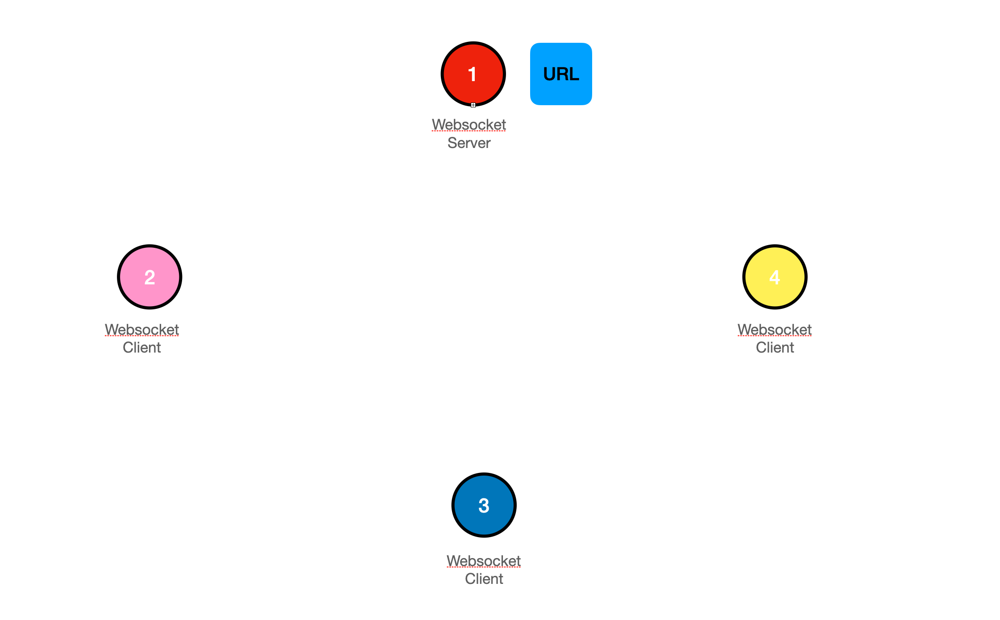  |  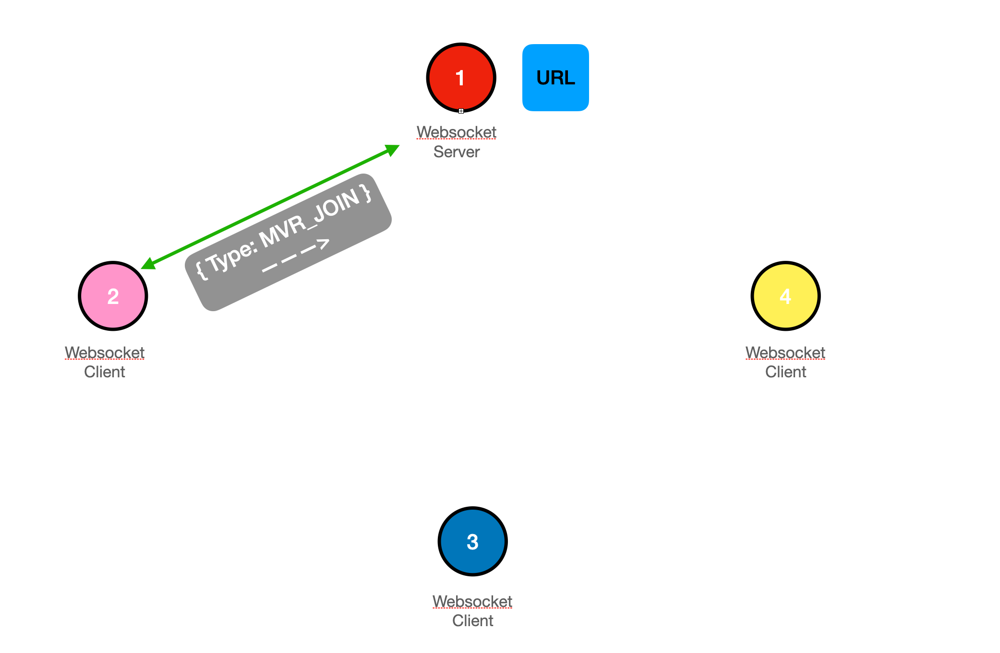 |

| Client 3 connects to the websocket sever and send a `MVR_JOIN` message | Client 3 connects to the websocket sever and send a `MVR_JOIN` message  |
|---|---|
| 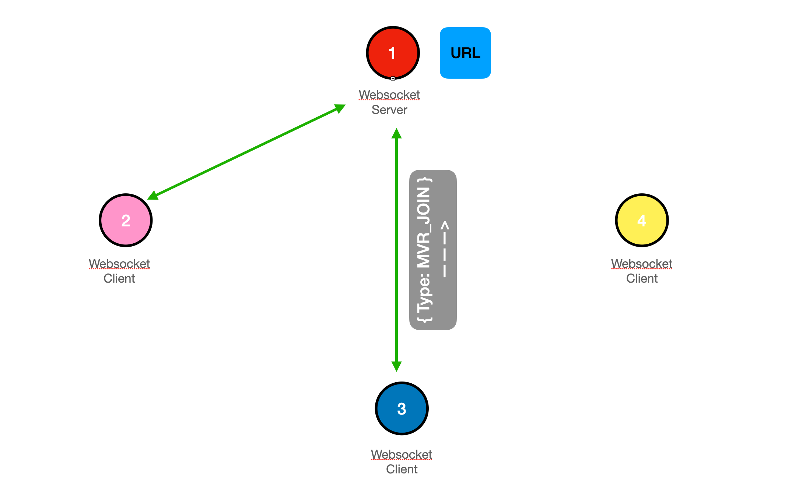  |  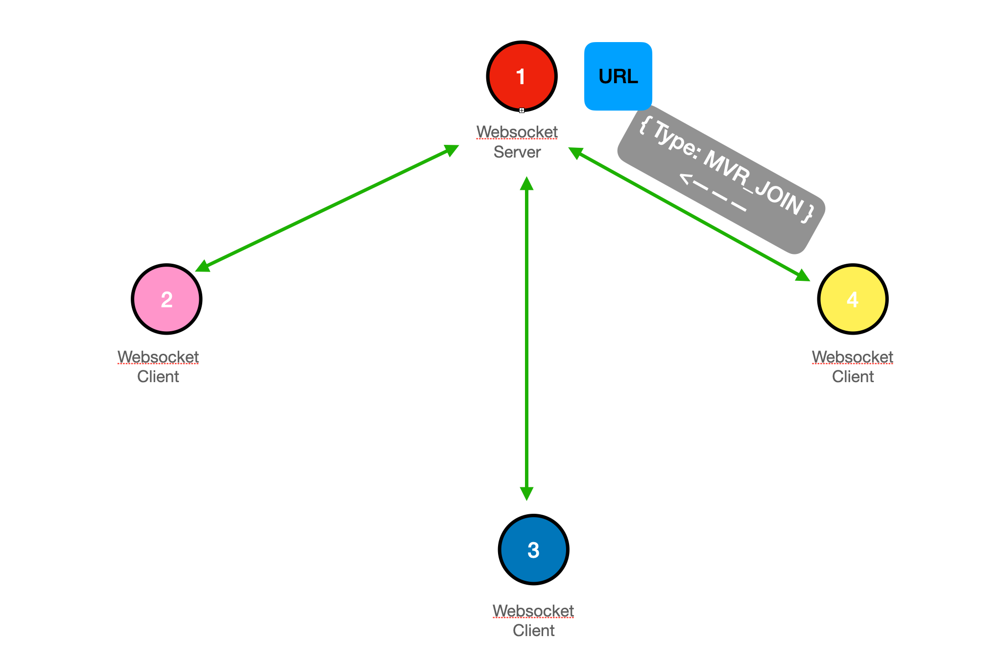 |

# Local Network Mode

| Client 2 joins the MVR Group  | and sends to all mDNS Service a `MVR_JOIN` message  |
|---|---|
| 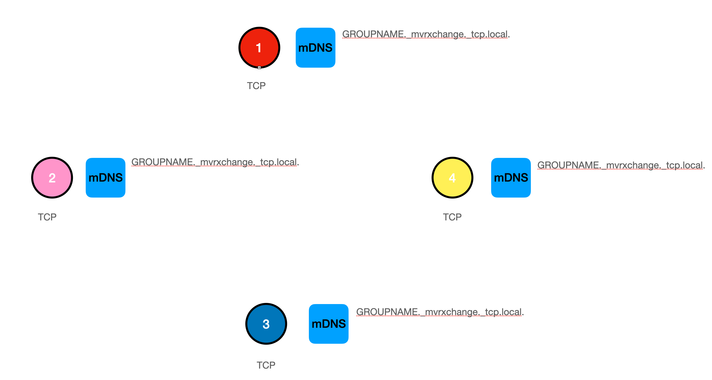  |  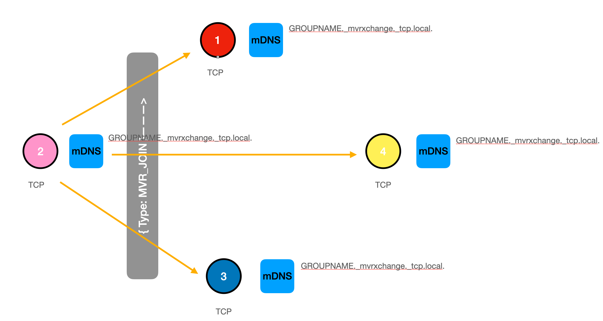 |


##### Table 42 — *MVR_JOIN message parameters*

| Attribute Name | Attribute Value Type                | Default Value when Optional | Description                                                                   |
| -------------- | ----------------------------------- | --------------------------- | ----------------------------------------------------------------------------- |
| Type       | [String](#user-content-attrtype-string)                              | Not Optional                | Defines the name of the package.                            |
| Provider       | [String](#user-content-attrtype-string)                              | Not Optional                | The application name providing MVR Import & Export                            |
| StationName       | [String](#user-content-attrtype-string)                              | Not Optional                | The Name that this station will be shown in UI.                            |
| verMajor       | [Integer](#user-content-attrtype-integer) | 0          | It is mandatory to transmit the current version of the MVR file as specified in Root File. If joining as new member send "0".               |
| verMinor       | [Integer](#user-content-attrtype-integer) | 0          | It is mandatory to transmit the current version of the MVR file as specified in Root File. If joining as new member send "0".               |
| ControllerPriority           | [Enum](#attrType-Enum)                 |  Not Optional               | Defines the priority that this device becomes the new Websocket Server when the active disapears from the network. The currently defined types are: Never, Low, High |
| UUID      | [UUID](#user-content-attrtype-uuid) |   Not Optional                          | UUID for the station inside the network. This UUID should be persistant across multiple start ups of the software on the same computer |


##### Table 43 — *MVR_JOIN response parameters*

| Attribute Name | Attribute Value Type                | Default Value when Optional | Description                                                                   |
| -------------- | ----------------------------------- | --------------------------- | ----------------------------------------------------------------------------- |
| Type       | [String](#user-content-attrtype-string)                              | Not Optional                |                             |
| OK                  | [Bool](#attrType-Bool)                       | Not Optional | True when operation is successfully, false when there is an error. Check the Message for more information in this case.                                                                                                             |
| Message       | [String](#user-content-attrtype-string)                              | Empty String | Human readable message when there is an error.                |                             |
| Message       | [Array of `MVR_COMMIT`](#user-content-attrtype-string)                              | Empty Array | List all available MVR files that are on this station in the format of the `MVR_COMMIT` packet.                |                             |


Example:
```
Request:
{
  "Type": "MVR_JOIN",
  "Provider":"MVRApplication", 
  "verMajor":"1", 
  "verMinor":"6", 
  "StationUUID":"", 
  "ControllerPriority":"Never", 
  "StationName":"MVR Application from user A at location B"
}
Response:
{
  "Type": "MVR_JOIN",
  "OK": "true",
  "Message": ""
  "Files": [
    {
      ...MVR_COMMIT_MESSAGE_ARGS
    },
    {
      ...MVR_COMMIT_MESSAGE_ARGS
    },
    {
      ...MVR_COMMIT_MESSAGE_ARGS
    }
  ]
}
```


## `MVR_LEAVE` packet

A client sends a `MVR_LEAVE` when it wants to quit an MVR Group and don't want to get updates about new MVR files any more.

For the Websocket mode: It is not required to terminate the Websockets connection, but it can be done.
For the Local Network Mode: It is not required that to turn down the mDNS service, but it can be done.

In order to join again, the client needs to and a `MVR_JOIN` package again.

| In Webssocket mode: Client 4 send a `MVR_LEAVE` message to the websocket server. | In Local Network Mode: Client 2 send a `MVR_LEAVE` message to all stations  |
|---|---|
| 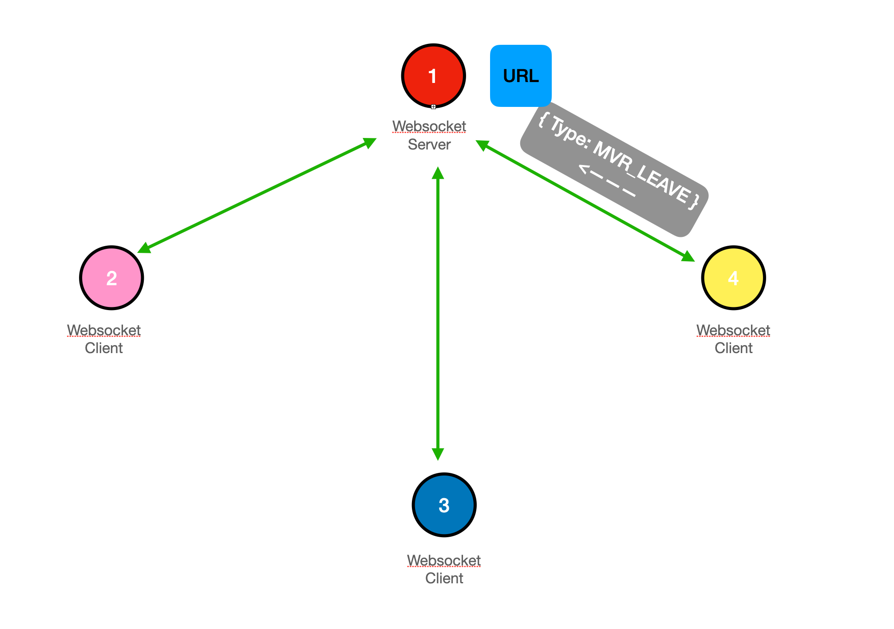  |  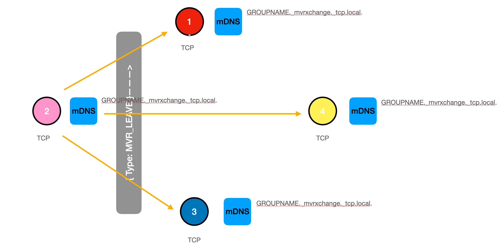 |


##### Table 42 — *MVR_LEAVE message parameters*

| Attribute Name | Attribute Value Type                | Default Value when Optional | Description                                                                   |
| -------------- | ----------------------------------- | --------------------------- | ----------------------------------------------------------------------------- |
| Type       | [String](#user-content-attrtype-string)                              | Not Optional                | Defines the name of the package.                            |
| FromStationUUID      | Array of [UUID](#user-content-attrtype-uuid) |                             | The UUID of the station. |


##### Table 43 — *MVR_LEAVE response parameters*

| Attribute Name | Attribute Value Type                | Default Value when Optional | Description                                                                   |
| -------------- | ----------------------------------- | --------------------------- | ----------------------------------------------------------------------------- |
| Type       | [String](#user-content-attrtype-string)                              | Not Optional                |                             |
| OK                  | [Bool](#attrType-Bool)                       | Not Optional | True when operation is successfully, false when there is an error. Check the Message for more information in this case.                                                                                                             |
| Message       | [String](#user-content-attrtype-string)                              | Empty String | Human readable message when there is an error.                |                             |


Example:
```
Request:
{
  "Type": "MVR_LEAVE",
  "StationUUID":"", 
}
Response:
{
  "Type": "MVR_LEAVE",
  "OK": "true",
  "Message": ""
}
```

## `MVR_COMMIT` packet

The MVR commit message informs all connected stations that there is a new MVR Commit. This message only informs the stations about the existence of the new file.
Stations needs to request the MVR file with a `MVR_REQUEST` package.

The following chart displays the process when one client sends a `MVR_COMMIT` package to the server, and the server distributes this in the session.

| Clients sends message to server  | Server send message to all conntected clients but the sender  |
|---|---|
| 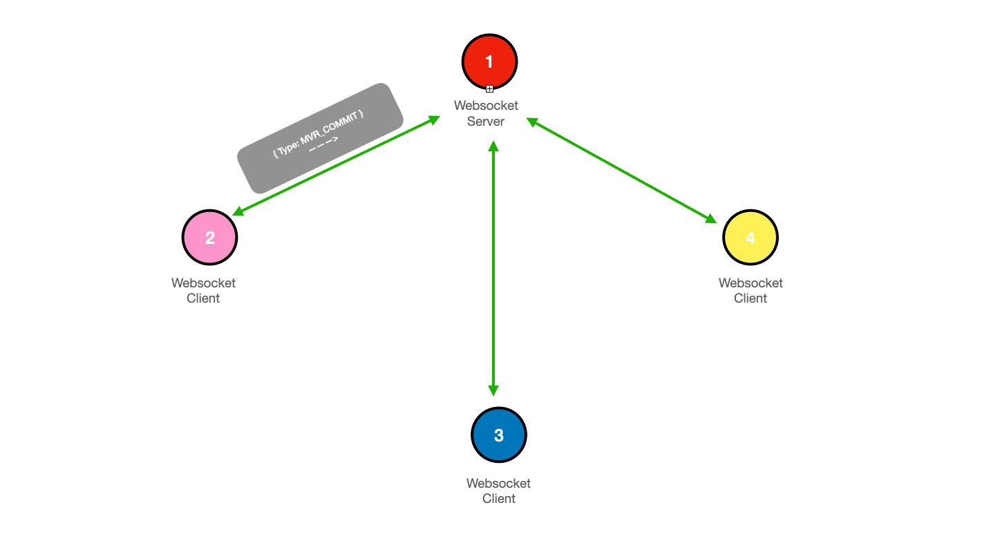  |  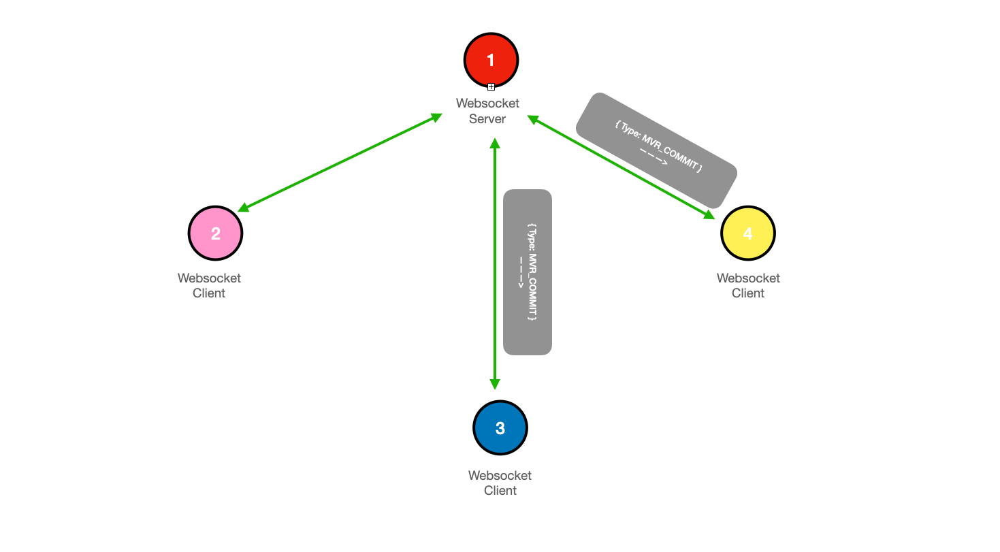 |

The following chart display the process when the server is the station who is providing a new MVR file. In this case the MVR info is directly transmitted to the connected stations.

| Server makes the `MVR_COMMIT` itself, and only sends it to connected clients |
|---|
| 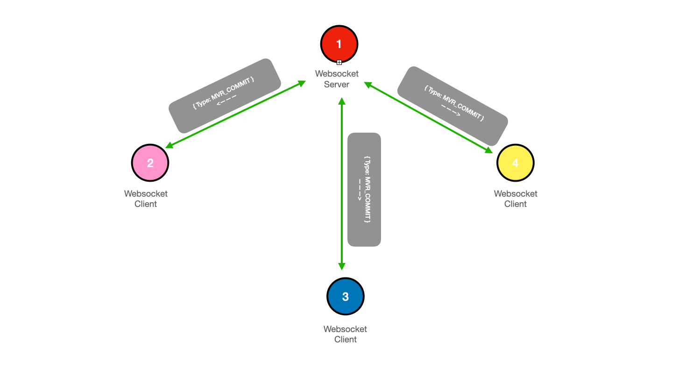  |

The following chart display the process when in Local Network Mode. The Client informs all other clients about the new commit. Not the that the client needs to respect the `MVR_LEAVE` messages itself.

| Client sends the `MVR_COMMIT` message to the connected stations. |
|---|
| 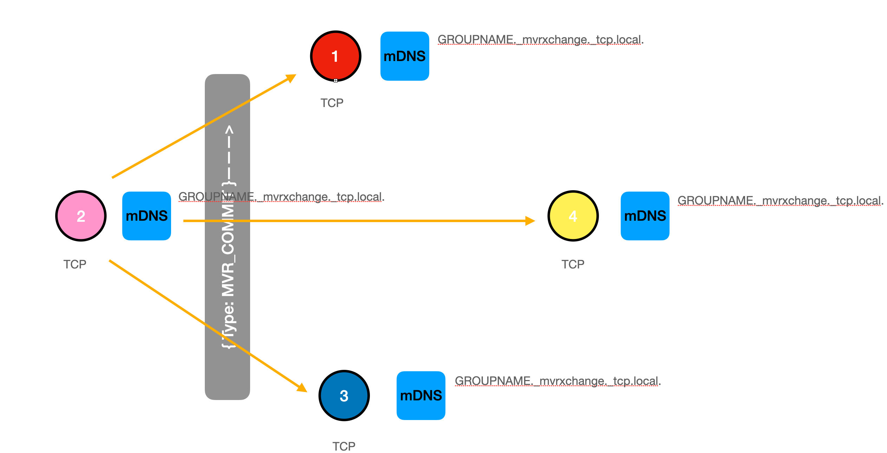  |

##### Table 42 — *MVR_COMMIT message parameters*

| Attribute Name | Attribute Value Type                | Default Value when Optional | Description                                                                   |
| -------------- | ----------------------------------- | --------------------------- | ----------------------------------------------------------------------------- |
| Type       | [String](#user-content-attrtype-string)                              | Not Optional                | Defines the name of the package.                            |
| verMajor       | [Integer](#user-content-attrtype-integer) | Not Optional          | It is mandatory to transmit the current version of the MVR file as specified in Root File. If joining as new member send "0".               |
| verMinor       | [Integer](#user-content-attrtype-integer) | Not Optional          | It is mandatory to transmit the current version of the MVR file as specified in Root File. If joining as new member send "0".               |
| FileSize       | [Integer](#user-content-attrtype-integer) | Not Optional          |                |
| FileUUID      | [UUID](#user-content-attrtype-uuid) |   Not Optional                          | The UUID of the MVR file. Generate a UUID using |
| FileUUID      | [UUID](#user-content-attrtype-uuid) |   Not Optional                          | UUID for the station inside the network. This UUID should be persistant across multiple start ups of the software on the same computer |
| ForStationsUUID      | Array of [UUID](#user-content-attrtype-uuid) |   []                          | Array with the station UUID that this MVR should be send to. When it is an empty array, the MVR will be send to all connected clients |
| Comment       | [String](#user-content-attrtype-string)                              |                 | Describes the changes made in this version of the MVR file.                            |


##### Table 43 — *MVR_COMMIT response parameters*

| Attribute Name | Attribute Value Type                | Default Value when Optional | Description                                                                   |
| -------------- | ----------------------------------- | --------------------------- | ----------------------------------------------------------------------------- |
| Type       | [String](#user-content-attrtype-string)                              | Not Optional                |                             |
| OK                  | [Bool](#attrType-Bool)                       | Not Optional | True when operation is successfully, false when there is an error. Check the Message for more information in this case.                                                                                                             |
| Message       | [String](#user-content-attrtype-string)                              | Empty String | Human readable message when there is an error.                |                             |


```
Request:
{
  "Type": "MVR_COMMIT",
  "verMajor":1, 
  "verMinor":6, 
  "FileUUID":"", 
  "ForStationsUUID":[], 
  "FileSize":256, 
  "Comment":"My complete description of what I have changed",
}
Response:
{
  "Type": "MVR_COMMIT",
  "OK": "true",
  "Message": ""
}
```
    
## `MVR_REQUEST` packet

This specific packet requests a MVR file from a station. You either can request a specific MVR via UUID or request and MVR from the current state.
You get the available MVR UUIDs from the `MVR_COMMIT` messages.

When you request the current MVR file, the station that exports the MVR should send `MVR_COMMIT` messages to the other connected stations.

When the station does not have the specifed MVR file, it returns a MVR_REQUEST Json Response, otherwise it sends the buffer of the MVR file.

> *Note:*
> When in Websocket Mode, the binery frame flag will be used to tell the receiver if a Buffer or JSON is send.


> *Note:* 
> When in Local Network Mode, the `MVR_PACKAGE_TYPE` flag will be used to tell the receiver if a Buffer or JSON is send

| Station requests a MVR from another station    | Server sends the request to the right station  |
|---|---|
| 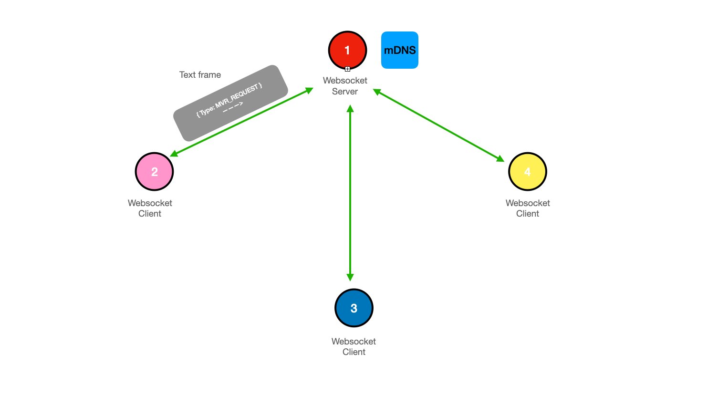  |  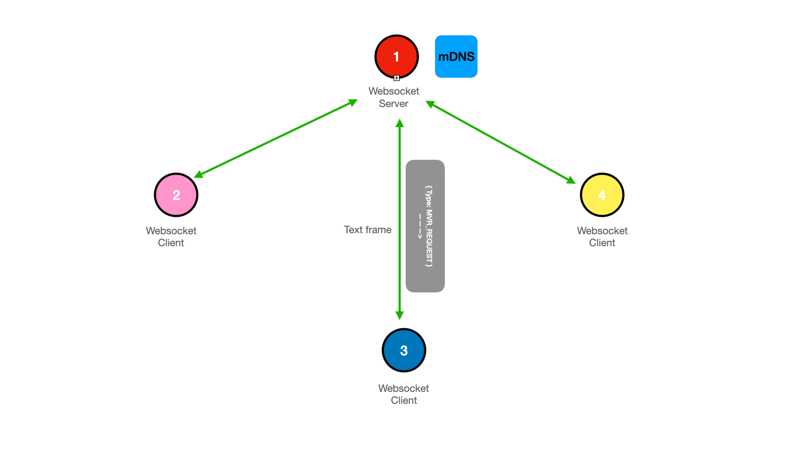 |

| Station sends the MVR file as binary data to the server | Server sends the MVR the MVR file as binary data to the station  |
|---|---|
| 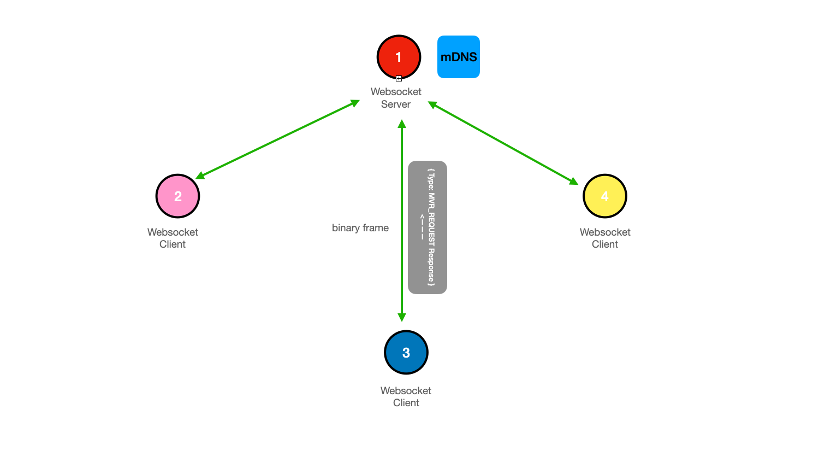  |  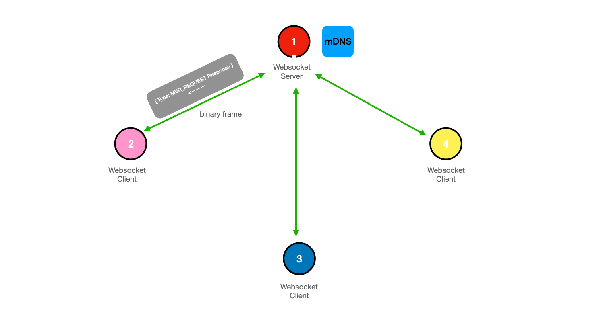 |


| Clients requests a MVR from another station   | First requested station does not have the MVR and sends back a failure message,  |
|---|---|
| 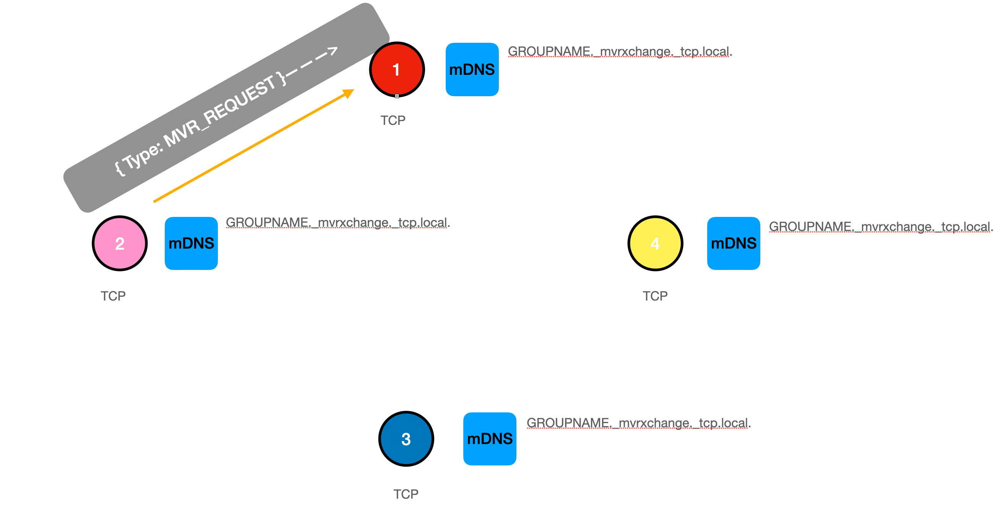  |  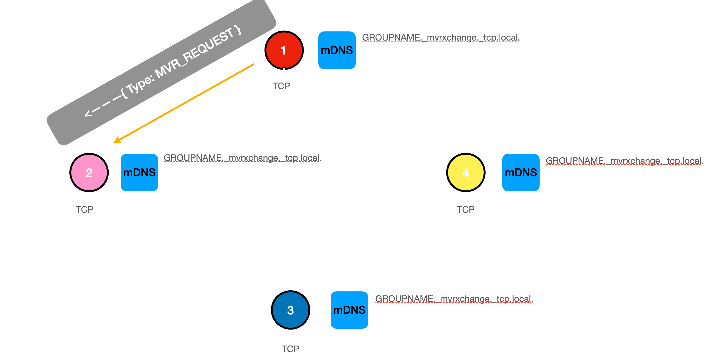 |

| Clients requests a MVR from another station | Second requested station does have the MVR and sends back the MVR file  |
|---|---|
| 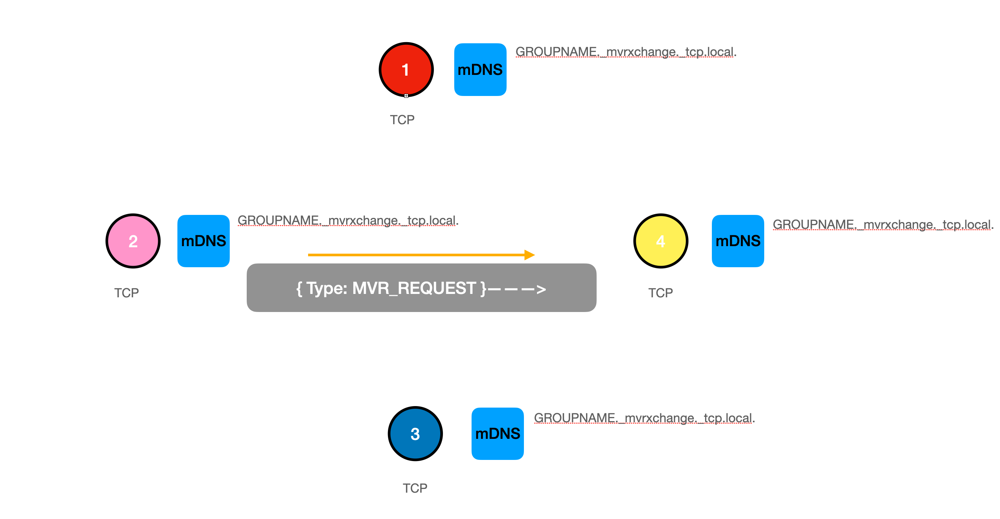  |  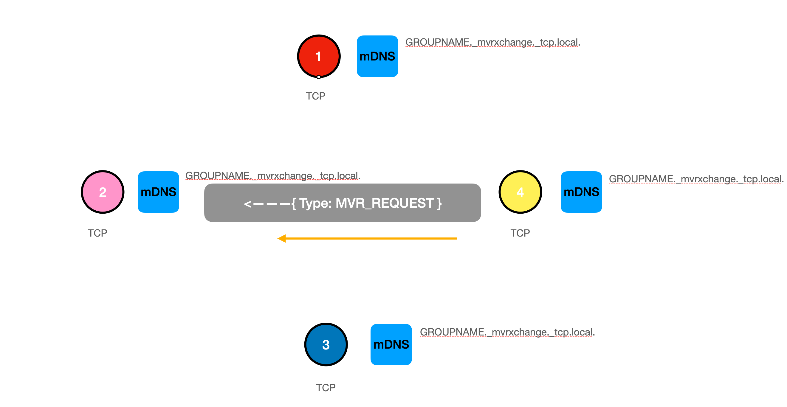 |

##### Table 42 — *MVR_REQUEST message parameters*

| Attribute Name | Attribute Value Type                | Default Value when Optional | Description                                                                   |
| -------------- | ----------------------------------- | --------------------------- | ----------------------------------------------------------------------------- |
| Type       | [String](#user-content-attrtype-string)                              | Not Optional                | Defines the name of the package.                            |
| FileUUID      | [UUID](#user-content-attrtype-uuid) |   Last MVR File from station                          | The UUID of the MVR file that you want to request. If you omit this field, the station should generate a MVR and send this.  |
| FromStationUUID      | Array of [UUID](#user-content-attrtype-uuid) |                             | The UUID of the station that you want this MVR from. |

##### Table 43 — *MVR_REQUEST error response parameters*

| Attribute Name | Attribute Value Type                | Default Value when Optional | Description                                                                   |
| -------------- | ----------------------------------- | --------------------------- | ----------------------------------------------------------------------------- |
| Type       | [String](#user-content-attrtype-string)                              | Not Optional                |                             |
| OK                  | [Bool](#attrType-Bool)                       | Not Optional | True when operation is successfully, false when there is an error. Check the Message for more information in this case.                                                                                                             |
| Message       | [String](#user-content-attrtype-string)                              | Empty String | Human readable message when there is an error.                |                             |


```
Request:
{
  "Type": "MVR_REQUEST",
  "FromStationUUID":"", 
  "FileUUID":"", 
}
Response:

binary frame

OR

{
  "Type": "MVR_REQUEST",
  "OK": "false",
  "Message": "The MVR is not available on this client"
}
```

## `MVR_NEW_SESSION_HOST` packet

This package tell other clients additional network configuration. 

When currently in Local Network Mode:
When the client is connected via Local Network Mode to the MVR Group, you can send a new Service Name to all connected station. All connected station should search for the new service name and, when available join them. Return OK when this is OK, Return false when this failed.

When the client is connected via Local Network Mode to the MVR Group, you can send a new Service URL to all connected station. All connected station should search if the URL is reachable. If this is the case return OK and switch to the websocket mode. Otherwise store the Service Name for the next startup.

When currently in Websocket mode:
When the client is connected via Websocket Mode to the MVR Group, you can send a new Service Name to all connected station. All connected station should search for the new service name and, when available join them. Return OK when this is OK, Return false when this failed.


##### Table 42 — *MVR_NEW_SESSION_HOST message parameters*

| Attribute Name | Attribute Value Type                | Default Value when Optional | Description                                                                   |
| -------------- | ----------------------------------- | --------------------------- | ----------------------------------------------------------------------------- |
| Type       | [String](#user-content-attrtype-string)                              | Not Optional                | Defines the name of the package.                            |
| ServiceName      | [String](#user-content-attrtype-string) |   Empty                          | Tells other connected devices the mDNS service name that should be used for this group. When empty, ignore. Otherwise connect with the new mDNS serice with an `MVR_JOIN` message  |
| ServiceURL      |  [String](#user-content-attrtype-string) |                             | Empty. | Tells other connected devices Service URL for the websocket mode that should be used for this group. When empty, ignore. Otherwise try to connect to the websocket. Only for Local Network Mode.

##### Table 43 — *MVR_NEW_SESSION_HOST error response parameters*

| Attribute Name | Attribute Value Type                | Default Value when Optional | Description                                                                   |
| -------------- | ----------------------------------- | --------------------------- | ----------------------------------------------------------------------------- |
| Type       | [String](#user-content-attrtype-string)                              | Not Optional                |                             |
| OK                  | [Bool](#attrType-Bool)                       | Not Optional | True when operation is successfully, false when there is an error. Check the Message for more information in this case.                                                                                                             |
| Message       | [String](#user-content-attrtype-string)                              | Empty String | Human readable message when there is an error.                |                             |


```
Request:
{
  "Type": "MVR_NEW_SESSION_HOST",
  "ServiceName":"MVR/fancyProjectGroup", 
  "ServiceURL":"www.mvr-share.com/api/fancyProjectGroup", 
}
Response:
{
  "Type": "MVR_NEW_SESSION_HOST",
  "OK": "true",
  "Message": ""

}
```

## The Idea of MVR-exchange Communication
The MVR exchange protocol should define an online or "on the wire" protocol to exchange MVR files in a network environment. Technically it should replace the USB-stick or file-saving process for an easier update of MVR changes within a working group. There are two basic user-stories to look at to define the goal of MVR exchange:

### Small Setup
One Programmer/Operator using a lighting desk, one or two visualizer and a planning software. Most likely all computers running the different applications are connected via a switch and are within reach. It would be no problem to use a USB-Stick to exchange files. But it would simplify the workflow by using MVR-exchange protocol because all machines are located and connected “automatically” and the exported files will be shared with all applications. The user still needs to change keyboard & mouse to control each application individually but that is a known “workflow limitation” as it applies for using the different applications anyway.
 
#### Advantages of this workflow
- No need to plug in a USB stick several times.
- No need to manually copy the files into the correct folder on different computers.
 
#### Add on
If an external person such as a planner or logistic person joins the network, they can instantly exchange the latest MVR files. Following the logic, the system of MVR-exchange can grow and be expanded.
 
### Large Setup
Multiple consoles each with a visualizer station, a tracking system, a planner, some media server in a rack and a lighting designer sharing a (pre-) programming room. All applications running on different computers are connected via network. One operator per station working locally with the visualizer while all other stations are manned by specialists.
Many stations need to be able to read and write MVR files to keep track of the current changes in the show. Most likely each and one needs to update at a different time due to the local workload and progress.
 
#### Advantages of this workflow
- No need to plug in a USB stick many times.
- No need to manually copy the files into the correct folder on different computers.
- Tracking of latest changes should be easier as in the network the files arrive in logical (timed) order.

### Rules that need to apply for the workflows described.
- The stations that handle MVR files need to find each other “automatically”.
- The stations will handle leaving/adding stations “automatically”.
- Data exchange will be initiated by a user pushing the button “MVR export”.
- The file will be saved locally and will be transmitted to the joined stations in the network.
- The file will be made available to all other stations in the network (stored in the local folder structure).
- The local user will be informed that a new file is available for import.
  
### What MVR-exchange cannot do!
- There is no live update of changes.
- There is no rule to always import all changes – ergo: there is no single file or source of truth.
- There is no offline update for stations joining later or leaving earlier.
- There is (currently) no way to connect stations via internet.


### Possible process of communication
Every application can join a particular "MVR group" to seperate between different working groups within one network. This will be a setting within the application and transmitted during the Discovery process.
Discovery will be executed by mDNS and by the rule-set of station priority the highest priority will create a Websocket Server and all other devices of the same "MVR group" will be able to communicate with the server. Once a user decides to export an MVR file with the current changes the information will be distributed via the Server to all applications. Each station has the option to decide to request an MVR-file as well. At least the server should hold the latest MVR files available. 
Suggested communication packes are still work in progress...


# Annex A. (normativ/informative)


## Revision History

This section lists all the changes that are made to MVR.

### Version 1.0

- Created the file format specification.

### Version 1.1

- Added information about the name of the archive
- Updated version attributes from the root node. We now have to
  integer values for this.
- The version attribute from the UserData node is now a String so it
  can contain any data.
- Make it clear that the SymDef can contain Symbol and Geometry3D
  nodes.
- Geometry3D file attribute defines the behavior if there is no
  extension for a file.
- Changed the matrix definition to match GDTF.
- Make it clear that a layers parent coordinate system is the global
  coordinate space.
- Give the option to have multiple addresses.
- Add DMX node to fixture. This can be used to define the DMX Mode for
  the GDTF file.

### Version 1.2

- Fixed a copy error in the Addresses Node. An Addresses Node can only
  contain Address Nodes.
- GDTFMode Node name now without white space.
- Added CIE Color for Fixture Node.
- Added Fixture Type ID
- Added Custom ID

### Version 1.3

- Fixed spelling mistakes.

### Version 1.4

- Updated UUID printing to match GDTF.

### Version 1.5

- Add support for Media Server and Mapping.
